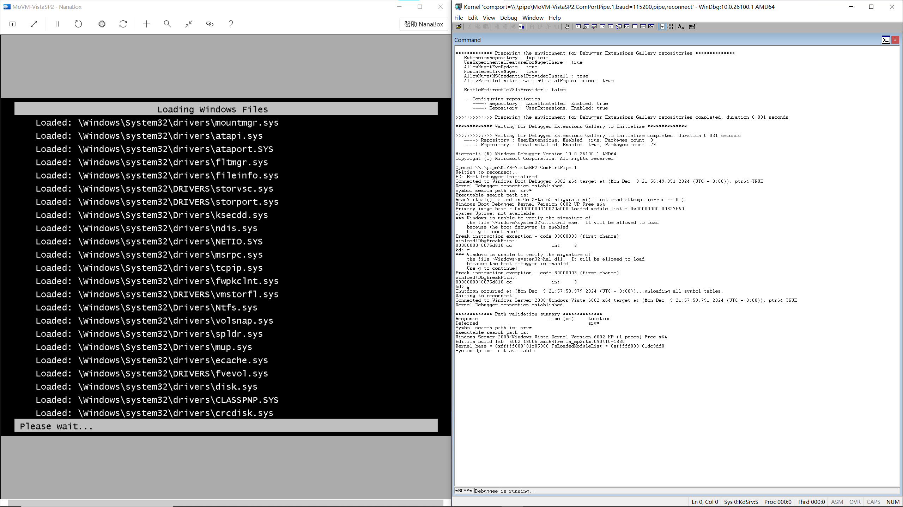
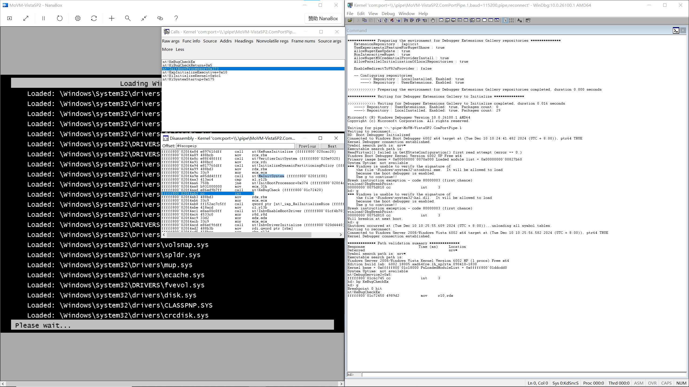
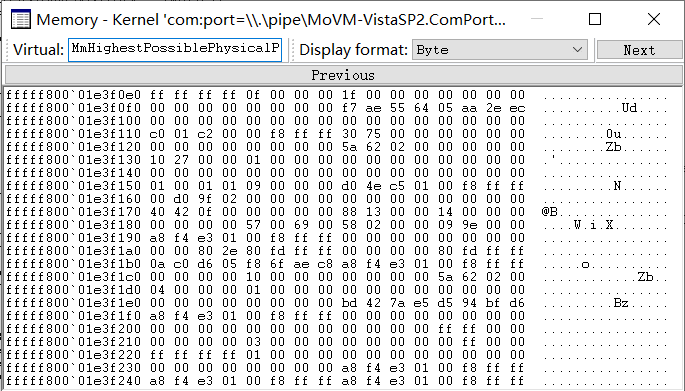
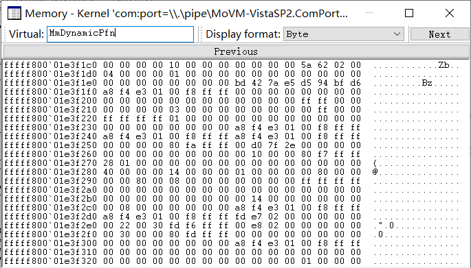

# Talk about booting Windows 7 Service Pack 1 on Hyper-V Generation 2 Virtual Machines

[简体中文](EarlyResearches.zh-CN.md)

As the guy who want to write bare-matal applications with as high level
programming languages like C/C++ as possible, I love the design of Hyper-V
Generation 2 Virtual Machines because it's one of validated popular
para-virtualization platforms via history, especially it should be the only
one with aggressive para-virtualization design in current stage:

- No CSM support. Only provides 64-Bit UEFI Class 3 firmware.
- No emulated devices. Only devices based on VMBus are available.
- No legacy x86 devices like the floppy controller, the DMA controller, the
  PCI Bus, the legacy Programmable Interrupt Controller (PIC), the legacy
  Programmable Interval Timer (PIT), and the Super I/O device. Needs guest
  operating systems to adapt explicitly.

It's good for me. I only need to write UEFI applications which only support
Hyper-V Generation 2 Virtual Machines, which is enough for my proof of concept
level ideas. It can help me avoid to adapt to the specific hardwares which need
to write a lot of assembly codes. Also, I love the lightweight design, lol.

Note: The Windows builtin Hyper-V client is really hard to use. It makes me
hesitate, until [Ben (Bingxing) Wang] told me that you can use Hyper-V Host
Compute System API which was newly at that time to implement the third-party
Hyper-V client, especially its stateless design may good for you, and you can
use ILSpy to learn how to use that. I had used several months to implement that
and make it open source at GitHub. If some people need to use the third-party
Hyper-V Host Compute System API created by me, please refer to the [NanaBox]. I
hope that project can help people who have the same feeling as me.

[Ben (Bingxing) Wang]: https://github.com/imbushuo
[NanaBox]: https://github.com/M2Team/NanaBox

As the design of Hyper-V Generation 2 Virtual Machines, 64-Bit Windows 8 and
Windows Server 2012 are the minimum Windows versions which support booting on
Hyper-V Generation 2 Virtual Machines. Also, Microsoft said that in the
[Generation 2 FAQ]:

> Q: Why are 64-bit versions of Windows Server 2008 R2 and Windows 7 not
  supported as generation 2 guest operating systems?

> A: Although Windows Server 2008 R2 and Windows 7 support UEFI, they depend on
  a programmable interrupt controller (PIC), which is not present in generation
  2 virtual machine hardware.

[Generation 2 FAQ]: https://learn.microsoft.com/en-us/previous-versions/windows/it-pro/windows-server-2012-r2-and-2012/dn282285(v=ws.11)#why-are-64-bit-versions-of-windows-server-2008-r2-and-windows-7-not-supported-as-generation-2-guest-operating-systems

But the reason is not enough to persuade me. I had started to do some
experiments to discover the real reason about half a year ago. Finally, I
accidently made booting Windows 7 Service Pack 1 on Hyper-V Generation 2
Virtual Machines. In the following sections, I will talk about the details.

Warning: I have no experience about writing Windows kernel drivers because I
cannot afford the price of the Windows driver signing certificate. Maybe my way
mentioned in this article is too wild and hope you can forgive me.

## Preliminary Information

We need to learn something preliminary before we start the journey.

### Minimum Windows guest build supports Hyper-V Generation 2 Virtual Machines

First, we need to know the actual minimum Windows build which supports booting
on Hyper-V Generation 2 Virtual Machines. It can help us to know how Microsoft
guys adapt to that.

The task is really simple because we only need to test which is the earliest
Windows build can boot on Hyper-V Generation 2 Virtual Machines.

As we all know, 64-Bit Windows 8 and Windows Server 2012 are the minimum Windows
versions which support booting on Hyper-V Generation 2 Virtual Machines. So we
only need to test builds mentioned in [Windows 8 - BetaWiki] and
[Windows Server 2012 - BetaWiki].

[Windows 8 - BetaWiki]: https://betawiki.net/wiki/Windows_8
[Windows Server 2012 - BetaWiki]: https://betawiki.net/wiki/Windows_Server_2012

We can divide these Windows builds into the following categories:

| Levels  | Behavior                                   |
|---------|--------------------------------------------|
| Level 0 | Boot failed with kernel deadloop           |
| Level 1 | Boot failed with ACPI issues               |
| Level 2 | Boot successfully with bootmgr replacement |
| Level 3 | Boot successfully without modifications    |


In the current stage, the minimum level 3 builds I found are Build 7990
(fbl_core1_hyp_dev), Build 8027 (fbl_fun_perf) or Build 8028 (winmain). The
minimum level 2 build I found is Build 8002 (fbl_grfx_dev1).

### Hyper-V guest interfaces definitions

For adapting to Hyper-V Generation 2 Virtual Machines, we need to know the
Hyper-V guest interfaces definitions. I have classified them as the open source
project [Mile.HyperV] and it provides the reference document to show where I get
the definitions.

[Mile.HyperV]: https://github.com/ProjectMile/Mile.HyperV

### ReactOS source code

Because Windows is not open source, we need to learn something about the hal and
ntoskrnl from ReactOS source code. Although the ReactOS x64 hal implementations
are too raw even for learning.

But for appreciating that project which helps me to learn something reliminary.
I also try to make boot ReactOS on Hyper-V Generation 2 Virtual Machines. But
there is no VMBus devices support because the ReactOS implementations are too
raw and lacks lots of things, which I have to use the ReactOS Longhorn
experimental branches. And [The_DarkFire] and [Timo Kreuzer] help me a lot for
learning that.

[The_DarkFire]: https://github.com/DarkFire01
[Timo Kreuzer]: https://github.com/tkreuzer

For people who have the ability to read the ReactOS source code, see
https://github.com/MouriNaruto/reactos/tree/remilia-hyperv-main-longhorn for my
modified branch.

### Suitable Windows versions for adaption

Because the virtual keyboard in Hyper-V Generation 2 Virtual Machines is a VMBus
device, we need to use Hyper-V Integration Services with version 6.2.9200.16385
or later if we want to have good user experience. So, the minimum requirements
for Hyper-V Integration Services with version 6.2.9200.16385 is the baseline for
us to choose the suitable Windows versions for additional adaption:

- 64-Bit Windows 7 RTM or Service Pack 1
- Windows Server 2008 R2 RTM or Service Pack 1
- 64-Bit Windows Vista Service Pack 2
- 64-Bit Windows Server 2008 Service Pack 2
- Windows XP Professional x64 Edition Service Pack 2
- Windows Server 2003 (x64) Service Pack 2

## Start the wild journey

Let's start the wild journey after we have learned the preliminary information.

### Prerequisites

- Install the Windows version you want to adapt to boot on Hyper-V Generation 2
  Virtual Machines in Hyper-V Generation 1 Virtual Machines, but you need to
  prepare a 100 MiB size FAT32 partition for the EFI System Partition (ESP).
- Install the Hyper-V Integration Services with version 6.2.9200.16385 or later.
- WinDbg is necessary for debugging the boot process.
- IDA Pro or similar tool for analyzing and patching.
- PE Tools or similar tool for recalculate the checksum of the modified files.
- Microsoft Copilot or similar services may help you to generate the opcode, lol.

### Create boot files for UEFI boot

After we have done the prerequisites, we need to mount the virtual machine's
hard disk file to your host machine and create the boot files for UEFI boot.

Assumes your mounted Windows partition is "G:" and the ESP partition is "F:".

First, we need to create the boot files for UEFI boot:

```cmd
bcdboot G:\Windows /s F: /f UEFI
```

Then, we need to set the debugging options to the Windows Boot Manager:

```cmd
bcdedit /store F:\EFI\Microsoft\Boot\BCD /bootdebug {default} on
bcdedit /store F:\EFI\Microsoft\Boot\BCD /debug {default} on
bcdedit /store F:\EFI\Microsoft\Boot\BCD /set {default} sos on
bcdedit /store F:\EFI\Microsoft\Boot\BCD /dbgsettings SERIAL DEBUGPORT:1 BAUDRATE:115200 /start ACTIVE
```

I also suggest you to set the boot manager timeout to 30 seconds:

```cmd
bcdedit /store F:\EFI\Microsoft\Boot\BCD /timeout 30
```

### Fix the BugCheck to ensure we can get the error message

If you start your virtual machine, you will see noting after detaching the
Windows Boot Debugger in the WinDbg command window. And you will find the
virtual machine instance process will have the high CPU usage. Some people
will know the OS kernel in the virtual machine is deadlooping.

Here is the screenshot to show that scenario, which uses the 64-Bit Windows
Vista Service Pack 2 as an example:


I find it's caused by BugCheck just for accident. When I tried to add 0xCC (the
opcode int 3) to make every possible effort to debug what cased the deadloop, I
find the virtual machine will reboot automatically with the triple fault when I
add that opcode to the beginning of the KeBugCheckEx function in ntoskrnl.exe.

So, the fix for that is easy. We can report the BugCheck error message to the
Hyper-V, and we can get the error message from the Windows Event Viewer.

According to Hyper-V Guest Crash Enlightenment Interface mentioned in Hypervisor
Top Level Functional Specification. We can write the following C code as the
KeBugCheckEx function implementation:

```c
DECLSPEC_NORETURN void WINAPI KeBugCheckEx(
    ULONG BugCheckCode,
    ULONG_PTR BugCheckParameter1,
    ULONG_PTR BugCheckParameter2,
    ULONG_PTR BugCheckParameter3,
    ULONG_PTR BugCheckParameter4)
{
    // HV_X64_MSR_CRASH_P0
    __writemsr(0x40000100, BugCheckCode);
    // HV_X64_MSR_CRASH_P1
    __writemsr(0x40000101, BugCheckParameter1);
    // HV_X64_MSR_CRASH_P2
    __writemsr(0x40000102, BugCheckParameter2);
    // HV_X64_MSR_CRASH_P3
    __writemsr(0x40000103, BugCheckParameter3);
    // HV_X64_MSR_CRASH_P4
    __writemsr(0x40000104, BugCheckParameter4);
    // HV_X64_MSR_CRASH_CTL with only setting CrashNotify to 1
    __writemsr(0x40000105, 0x8000000000000000);
    _disable();
    __halt();
    return;
}
```

Here is the assembly for the above C code:

```asm
mov r10, rdx
mov eax, ecx
mov edx, ecx
mov ecx, 40000100h
shr rdx, 20h
wrmsr

mov rdx, r10
mov rax, r10
shr rdx, 20h
mov ecx, 40000101h
wrmsr

mov rdx, r8
mov rax, r8
shr rdx, 20h
mov ecx, 40000102h
wrmsr

mov rdx, r9
mov rax, r9
shr rdx, 20h
mov ecx, 40000103h
wrmsr

mov rdx, [rsp+arg_20]
mov ecx, 40000104h
mov rax, rdx
shr rdx, 20h
wrmsr

xor eax, eax
mov edx, 80000000h
mov ecx, 40000105h
wrmsr

cli
hlt

retn 0
```

Use some tools to convert the above assembly to the machine opcode:

```
49 89 D2
89 C8
89 CA
B9 00 01 00 40
48 C1 EA 20
0F 30 

4C 89 D2 
4C 89 D0
48 C1 EA 20
B9 01 01 00 40
0F 30

4C 89 C2
4C 89 C0
48 C1 EA 20
B9 02 01 00 40
0F 30

4C 89 CA
4C 89 C8
48 C1 EA 20
B9 03 01 00 40
0F 30

48 8B 54 24 28
B9 04 01 00 40
48 89 D0
48 C1 EA 20
0F 30

31 C0
BA 00 00 00 80
B9 05 01 00 40
0F 30

FA
F4

C2 00 00
```

When we use tools like IDA Pro to patch the KeBugCheckEx function in
ntoskrnl.exe with the above opcode, use PE Tools to recalculate the
checksum of the modified ntoskrnl.exe, and then replace the original
ntoskrnl.exe with the modified one. We can get the error message from
the Windows Event Viewer.

```xml
<Event xmlns="http://schemas.microsoft.com/win/2004/08/events/event">
  <System>
    <Provider Name="Microsoft-Windows-Hyper-V-Worker" Guid="{51ddfa29-d5c8-4803-be4b-2ecb715570fe}" />
    <EventID>18590</EventID>
    <Version>0</Version>
    <Level>1</Level>
    <Task>0</Task>
    <Opcode>0</Opcode>
    <Keywords>0x8000000000000000</Keywords>
    <TimeCreated SystemTime="2024-12-09T11:31:23.2356205Z" />
    <EventRecordID>35726</EventRecordID>
    <Correlation />
    <Execution ProcessID="1268" ThreadID="3476" />
    <Channel>Microsoft-Windows-Hyper-V-Worker-Admin</Channel>
    <Computer>DESKTOP-OLUNT6J</Computer>
    <Security UserID="S-1-5-83-1-3655396106-1351506743-3915871121-3476744365" />
  </System>
  <UserData>
    <VmlEventLog xmlns="http://www.microsoft.com/Windows/Virtualization/Events">
      <VmName>Virtual Machine</VmName>
      <VmId>D9E0EB0A-5B37-508E-9173-67E9ADE83ACF</VmId>
      <VmErrorCode0>0x79</VmErrorCode0>
      <VmErrorCode1>0x6</VmErrorCode1>
      <VmErrorCode2>0x0</VmErrorCode2>
      <VmErrorCode3>0x0</VmErrorCode3>
      <VmErrorCode4>0x0</VmErrorCode4>
      <VmErrorMessage>
      </VmErrorMessage>
    </VmlEventLog>
  </UserData>
</Event>
```

### Make the Windows Kernel Debugger available to use

From the above error message, we can search the Microsoft documentation for
that. In [Bug Check 0x79: MISMATCHED_HAL], you will know it's the issue in
hal.dll. We need to do some patches to fix that.

[Bug Check 0x79: MISMATCHED_HAL]: https://learn.microsoft.com/en-us/windows-hardware/drivers/debugger/bug-check-0x79--mismatched-hal

After some analysis, I find the issue is caused by the following pesudo code
from the HalpInitMpInfo function in hal.dll

```c
if ( (*(_BYTE *)(HalpApicTable + 40) & 1) == 0 )
    KeBugCheckEx(0x79u, 6ui64, 0i64, 0i64, 0i64);
```

Refer to the [dumped APIC table in Hyper-V Generation 2 Virtual Machines], we
will know it's just check the flag in the APIC table. The HAL will call the
KeBugCheckEx function if it cannot find the PC-AT Compatibility.

[dumped APIC table in Hyper-V Generation 2 Virtual Machines]: https://github.com/MouriNaruto/MouriDocs/blob/main/docs/11/References/ACPI/22621/Disassembled/apic.dsl

We can patch that just with jmp opcode to bypass that logic.

For example, the original code snippet is:

```
PAGELK:000007FF3C250CC2 33 FF                                   xor     edi, edi
PAGELK:000007FF3C250CC4 41 F6 44 24 28 01                       test    byte ptr [r12+28h], 1
PAGELK:000007FF3C250CCA 4D 8B F8                                mov     r15, r8
PAGELK:000007FF3C250CCD 44 8B F2                                mov     r14d, edx
PAGELK:000007FF3C250CD0 75 18                                   jnz     short loc_7FF3C250CEA
PAGELK:000007FF3C250CD2 8D 57 06                                lea     edx, [rdi+6]    ; BugCheckParameter1
PAGELK:000007FF3C250CD5 8D 4F 79                                lea     ecx, [rdi+79h]  ; BugCheckCode
PAGELK:000007FF3C250CD8 45 33 C9                                xor     r9d, r9d        ; BugCheckParameter3
PAGELK:000007FF3C250CDB 45 33 C0                                xor     r8d, r8d        ; BugCheckParameter2
PAGELK:000007FF3C250CDE 48 89 7C 24 20                          mov     [rsp+68h+BugCheckParameter4], rdi ; BugCheckParameter4
PAGELK:000007FF3C250CE3 FF 15 1F 88 FE FF                       call    cs:__imp_KeBugCheckEx
PAGELK:000007FF3C250CE3                         ; ---------------------------------------------------------------------------
PAGELK:000007FF3C250CE9 CC                                      align 2
PAGELK:000007FF3C250CEA
PAGELK:000007FF3C250CEA                         loc_7FF3C250CEA:                        ; CODE XREF: HalpInitMpInfo+38↑j
PAGELK:000007FF3C250CEA 3B D7                                   cmp     edx, edi
PAGELK:000007FF3C250CEC 0F 85 75 02 00 00                       jnz     loc_7FF3C250F67
PAGELK:000007FF3C250CF2 48 39 3D 8F 65 FF FF                    cmp     cs:HalpProcLocalApicTable, rdi
PAGELK:000007FF3C250CF9 0F 85 68 02 00 00                       jnz     loc_7FF3C250F67
PAGELK:000007FF3C250CFF 45 8B 44 24 04                          mov     r8d, [r12+4]
PAGELK:000007FF3C250D04 49 8D 54 24 2C                          lea     rdx, [r12+2Ch]
PAGELK:000007FF3C250D09 44 8B CF                                mov     r9d, edi
PAGELK:000007FF3C250D0C 44 8B EF                                mov     r13d, edi
PAGELK:000007FF3C250D0F 8B F7                                   mov     esi, edi
PAGELK:000007FF3C250D11 4D 03 C4                                add     r8, r12
```

Just modify "jnz short loc_7FF3C250CEA" to "jmp short loc_7FF3C250CEA".

Of course, use the similar way to patch the hal.dll, we can finally see the
Windows Kernel Debugger message in the WinDbg command window.

Here is the screenshot to show that scenario, which uses the 64-Bit Windows
Vista Service Pack 2 as an example:



### Fix the timer scaling implementation in hal.dll

In the current stage, you will find your virtual machine is deadlooping.

You will find its caused by the HalpScaleTimers function in hal.dll with some
analysis via WinDbg.

We need to patch the HalpScaleTimers function in hal.dll to make it workable.

For example, the original code snippet is:

```
.text:000007FF3C232060 48 89 5C 24 08                          mov     [rsp+arg_0], rbx
.text:000007FF3C232065 48 89 7C 24 10                          mov     [rsp+arg_8], rdi
.text:000007FF3C23206A 9C                                      pushfq
.text:000007FF3C23206B 48 83 EC 20                             sub     rsp, 20h
.text:000007FF3C23206F 33 C9                                   xor     ecx, ecx
.text:000007FF3C232071 E8 1E F7 FE FF                          call    HalpAcquireCmosSpinLockEx
.text:000007FF3C232076 FA                                      cli
.text:000007FF3C232077 80 3D A2 D4 00 00 00                    cmp     cs:HalpScaleWithPmTimer, 0
.text:000007FF3C23207E 74 55                                   jz      short loc_7FF3C2320D5
.text:000007FF3C232080 E8 DB 67 00 00                          call    HalpProcessorFence
.text:000007FF3C232085 C7 04 25 80 03 FE FF FF                 mov     dword ptr ds:0FFFFFFFFFFFE0380h, 0FFFFFFFFh
.text:000007FF3C232085 FF FF FF
.text:000007FF3C232090 8B 3C 25 90 03 FE FF                    mov     edi, ds:0FFFFFFFFFFFE0390h
.text:000007FF3C232097 0F 31                                   rdtsc
.text:000007FF3C232099 48 C1 E2 20                             shl     rdx, 20h
.text:000007FF3C23209D B9 D3 D3 06 00                          mov     ecx, 6D3D3h
.text:000007FF3C2320A2 48 0B C2                                or      rax, rdx
.text:000007FF3C2320A5 48 8B D8                                mov     rbx, rax
.text:000007FF3C2320A8 E8 B3 B6 FF FF                          call    HalpPmTimerTickCountStall
.text:000007FF3C2320AD E8 AE 67 00 00                          call    HalpProcessorFence
.text:000007FF3C2320B2 44 8B 1C 25 90 03 FE FF                 mov     r11d, ds:0FFFFFFFFFFFE0390h
.text:000007FF3C2320BA 41 2B FB                                sub     edi, r11d
.text:000007FF3C2320BD 0F 31                                   rdtsc
.text:000007FF3C2320BF 48 C1 E2 20                             shl     rdx, 20h
.text:000007FF3C2320C3 C1 E7 03                                shl     edi, 3
.text:000007FF3C2320C6 48 0B C2                                or      rax, rdx
.text:000007FF3C2320C9 48 2B C3                                sub     rax, rbx
.text:000007FF3C2320CC 4C 8B C8                                mov     r9, rax
.text:000007FF3C2320CF 49 C1 E1 03                             shl     r9, 3
.text:000007FF3C2320D3 EB 68                                   jmp     short loc_7FF3C23213D
.text:000007FF3C2320D5                         ; ---------------------------------------------------------------------------
.text:000007FF3C2320D5
.text:000007FF3C2320D5                         loc_7FF3C2320D5:                        ; CODE XREF: HalpScaleTimers+1E↑j
.text:000007FF3C2320D5 C7 04 25 80 03 FE FF FF                 mov     dword ptr ds:0FFFFFFFFFFFE0380h, 0FFFFFFFFh
.text:000007FF3C2320D5 FF FF FF
.text:000007FF3C2320E0 66 BA 70 00                             mov     dx, 70h ; 'p'
.text:000007FF3C2320E4 B0 0A                                   mov     al, 0Ah
.text:000007FF3C2320E6 EE                                      out     dx, al          ; CMOS Memory/RTC Index Register:
.text:000007FF3C2320E6                                                                 ; RTC Register A
.text:000007FF3C2320E7
.text:000007FF3C2320E7                         loc_7FF3C2320E7:                        ; CODE XREF: HalpScaleTimers+8B↓j
.text:000007FF3C2320E7 E4 71                                   in      al, 71h         ; CMOS Memory/RTC Data Register
.text:000007FF3C2320E9 84 C0                                   test    al, al
.text:000007FF3C2320EB 78 FA                                   js      short loc_7FF3C2320E7
.text:000007FF3C2320ED
.text:000007FF3C2320ED                         loc_7FF3C2320ED:                        ; CODE XREF: HalpScaleTimers+91↓j
.text:000007FF3C2320ED E4 71                                   in      al, 71h         ; CMOS Memory/RTC Data Register
.text:000007FF3C2320EF 84 C0                                   test    al, al
.text:000007FF3C2320F1 79 FA                                   jns     short loc_7FF3C2320ED
.text:000007FF3C2320F3 E8 68 67 00 00                          call    HalpProcessorFence
.text:000007FF3C2320F8 0F 31                                   rdtsc
.text:000007FF3C2320FA 8B 3C 25 90 03 FE FF                    mov     edi, ds:0FFFFFFFFFFFE0390h
.text:000007FF3C232101 48 C1 E2 20                             shl     rdx, 20h
.text:000007FF3C232105 48 0B C2                                or      rax, rdx
.text:000007FF3C232108 48 8B D8                                mov     rbx, rax
.text:000007FF3C23210B 66 BA 70 00                             mov     dx, 70h ; 'p'
.text:000007FF3C23210F B0 0A                                   mov     al, 0Ah
.text:000007FF3C232111 EE                                      out     dx, al          ; CMOS Memory/RTC Index Register:
.text:000007FF3C232111                                                                 ; RTC Register A
.text:000007FF3C232112
.text:000007FF3C232112                         loc_7FF3C232112:                        ; CODE XREF: HalpScaleTimers+B6↓j
.text:000007FF3C232112 E4 71                                   in      al, 71h         ; CMOS Memory/RTC Data Register
.text:000007FF3C232114 84 C0                                   test    al, al
.text:000007FF3C232116 78 FA                                   js      short loc_7FF3C232112
.text:000007FF3C232118
.text:000007FF3C232118                         loc_7FF3C232118:                        ; CODE XREF: HalpScaleTimers+BC↓j
.text:000007FF3C232118 E4 71                                   in      al, 71h         ; CMOS Memory/RTC Data Register
.text:000007FF3C23211A 84 C0                                   test    al, al
.text:000007FF3C23211C 79 FA                                   jns     short loc_7FF3C232118
.text:000007FF3C23211E E8 3D 67 00 00                          call    HalpProcessorFence
.text:000007FF3C232123 44 8B 1C 25 90 03 FE FF                 mov     r11d, ds:0FFFFFFFFFFFE0390h
.text:000007FF3C23212B 41 2B FB                                sub     edi, r11d
.text:000007FF3C23212E 0F 31                                   rdtsc
.text:000007FF3C232130 48 C1 E2 20                             shl     rdx, 20h
.text:000007FF3C232134 48 0B C2                                or      rax, rdx
.text:000007FF3C232137 4C 8B C8                                mov     r9, rax
.text:000007FF3C23213A 4C 2B CB                                sub     r9, rbx
.text:000007FF3C23213D
.text:000007FF3C23213D                         loc_7FF3C23213D:                        ; CODE XREF: HalpScaleTimers+73↑j
.text:000007FF3C23213D 65 48 8B 1C 25 18 00 00                 mov     rbx, gs:18h
.text:000007FF3C23213D 00
.text:000007FF3C232146 65 4C 8B 04 25 18 00 00                 mov     r8, gs:18h
.text:000007FF3C232146 00
.text:000007FF3C23214F 49 BA 4B 59 86 38 D6 C5                 mov     r10, 346DC5D63886594Bh
.text:000007FF3C23214F 6D 34
.text:000007FF3C232159 49 8D 89 88 13 00 00                    lea     rcx, [r9+1388h]
.text:000007FF3C232160 49 8B C2                                mov     rax, r10
.text:000007FF3C232163 48 F7 E1                                mul     rcx
.text:000007FF3C232166 8B CF                                   mov     ecx, edi
.text:000007FF3C232168 49 8B C2                                mov     rax, r10
.text:000007FF3C23216B 48 C1 EA 0B                             shr     rdx, 0Bh
.text:000007FF3C23216F 48 81 C1 88 13 00 00                    add     rcx, 1388h
.text:000007FF3C232176 48 69 D2 10 27 00 00                    imul    rdx, 2710h
.text:000007FF3C23217D 48 89 93 C0 00 00 00                    mov     [rbx+0C0h], rdx
.text:000007FF3C232184 48 F7 E1                                mul     rcx
.text:000007FF3C232187 48 B8 DB 34 B6 D7 82 DE                 mov     rax, 431BDE82D7B634DBh
.text:000007FF3C232187 1B 43
.text:000007FF3C232191 48 8B CA                                mov     rcx, rdx
.text:000007FF3C232194 48 C1 E9 0B                             shr     rcx, 0Bh
.text:000007FF3C232198 49 F7 E1                                mul     r9
.text:000007FF3C23219B 69 C9 10 27 00 00                       imul    ecx, 2710h
.text:000007FF3C2321A1 48 C1 EA 12                             shr     rdx, 12h
.text:000007FF3C2321A5 0F BA 64 24 20 09                       bt      [rsp+28h+var_8], 9
.text:000007FF3C2321AB 89 8B DC 00 00 00                       mov     [rbx+0DCh], ecx
.text:000007FF3C2321B1 41 89 50 64                             mov     [r8+64h], edx
.text:000007FF3C2321B5 65 48 8B 04 25 20 00 00                 mov     rax, gs:20h
.text:000007FF3C2321B5 00
.text:000007FF3C2321BE 89 90 F4 05 00 00                       mov     [rax+5F4h], edx
.text:000007FF3C2321C4 89 8B D8 00 00 00                       mov     [rbx+0D8h], ecx
.text:000007FF3C2321CA 89 0C 25 80 03 FE FF                    mov     ds:0FFFFFFFFFFFE0380h, ecx
.text:000007FF3C2321D1 73 01                                   jnb     short loc_7FF3C2321D4
.text:000007FF3C2321D3 FB                                      sti
.text:000007FF3C2321D4
.text:000007FF3C2321D4                         loc_7FF3C2321D4:                        ; CODE XREF: HalpScaleTimers+171↑j
.text:000007FF3C2321D4 E8 8F F5 FE FF                          call    HalpReleaseCmosSpinLock
.text:000007FF3C2321D9 8B 83 DC 00 00 00                       mov     eax, [rbx+0DCh]
.text:000007FF3C2321DF 48 8B 5C 24 30                          mov     rbx, [rsp+28h+arg_0]
.text:000007FF3C2321E4 48 8B 7C 24 38                          mov     rdi, [rsp+28h+arg_8]
.text:000007FF3C2321E9 48 83 C4 20                             add     rsp, 20h
.text:000007FF3C2321ED 59                                      pop     rcx
.text:000007FF3C2321EE C3                                      retn
```

The following changes should be made first:

- Modify "jz short loc_7FF3C2320D5" to "jmp short loc_7FF3C2320D5".
- Nop "js short loc_7FF3C2320E7".
- Nop "jns short loc_7FF3C2320ED".
- Nop "js short loc_7FF3C232112".
- Nop "jns short loc_7FF3C232118".

Then you need to rewrite the following code snippet:

```
.text:000007FF3C232123 44 8B 1C 25 90 03 FE FF                 mov     r11d, ds:0FFFFFFFFFFFE0390h
.text:000007FF3C23212B 41 2B FB                                sub     edi, r11d
.text:000007FF3C23212E 0F 31                                   rdtsc
.text:000007FF3C232130 48 C1 E2 20                             shl     rdx, 20h
.text:000007FF3C232134 48 0B C2                                or      rax, rdx
.text:000007FF3C232137 4C 8B C8                                mov     r9, rax
.text:000007FF3C23213A 4C 2B CB                                sub     r9, rbx
```

To the following code snippet:

```
.text:000007FF3C232123 B9 23 00 00 40                          mov     ecx, 40000023h
.text:000007FF3C232128 0F 32                                   rdmsr
.text:000007FF3C23212A 89 C7                                   mov     edi, eax
.text:000007FF3C23212C B9 22 00 00 40                          mov     ecx, 40000022h
.text:000007FF3C232131 0F 32                                   rdmsr
.text:000007FF3C232133 48 C1 E2 20                             shl     rdx, 20h
.text:000007FF3C232137 48 0B C2                                or      rax, rdx
.text:000007FF3C23213A 4C 8B C8                                mov     r9, rax
```

Of course, use the similar way to patch the hal.dll, we can finally we can pass
the HalInitSystem stage successfully, but we will see the BugCheck after the
MmInitSystem funtion called by InitBootProcessor function.

Here is the screenshot to show that scenario, which uses the 64-Bit Windows
Vista Service Pack 2 as an example:



### Disable the dynamic partitioning policy in ntoskrnl.exe

Although the MmInitSystem funtion is complex, luckily we have the global
variable called MiInitFailure for knowning the failure reason for the
MmInitSystem funtion.

We will know the value of MiInitFailure is 14 when using the WinDbg memory
window.

Here is the screenshot to show that scenario, which uses the 64-Bit Windows
Vista Service Pack 2 as an example:


For something set the MiInitFailure to 14, we can find the following pesudo code
snippet in the MmInitNucleus function:

```c
  PoolWithTag = ExAllocatePoolWithTag(
                  NonPagedPool,
                  4 * ((unsigned __int64)(*(_QWORD *)&MmHighestPossiblePhysicalPage + 32i64) >> 5),
                  0x20206D4Du);
  if ( !PoolWithTag )
  {
    MiInitFailure = 14;
    return 0;
  }
```

We will know the value of MmHighestPossiblePhysicalPage is much bigger than the
virtual machine memory we set when using the WinDbg memory window.

Here is the screenshot to show that scenario, which uses the 64-Bit Windows
Vista Service Pack 2 as an example:



For something set the MmHighestPossiblePhysicalPage, we can find the following
pesudo code snippet in the MiFindLargestLoaderDescriptor function:

```c
  v13 = MmDynamicPfn;
  if ( MmDynamicPfn )
  {
    if ( v5 > MmDynamicPfn - 1 )
      v13 = v5 + 1;
    if ( v13 > 0x1000000000i64 )
      v13 = 0x1000000000i64;
    MmDynamicPfn = v13;
    *(_QWORD *)&MmHighestPossiblePhysicalPage = v13 - 1;
  }
  else
  {
    *(_QWORD *)&MmHighestPossiblePhysicalPage = v5;
  }
```

We will know the value of MmDynamicPfn will cause the issue when using the
WinDbg memory window.

Here is the screenshot to show that scenario, which uses the 64-Bit Windows
Vista Service Pack 2 as an example:



For something set the MmDynamicPfn, we can find the following pesudo code
snippet in the MiInitializeBootDefaults function:

```c
  if ( MmDynamicMemorySupported )
  {
    MmDynamicPfn <<= 18;
    if ( !MmDynamicPfn && (int)off_140172A88(17i64, 8i64, &v16, &v15) >= 0 )
      MmDynamicPfn = v16 / 4096;
  }
  else
  {
    MmDynamicPfn = 0i64;
  }
```

Oh, it seems the the dynamic partitioning policy in ntoskrnl.exe caused the
MmInitSystem funtion failed.

Here is the screenshot to show that scenario, which uses the 64-Bit Windows
Vista Service Pack 2 as an example:


Patch for making MmDynamicMemorySupported to 0 is simple. Just patch the
InitializeDynamicPartitioningPolicy function in ntoskrnl.exe.

For example, the original code snippet is:

```
INIT:00000001404B40B0 FF F7                                   push    rdi
INIT:00000001404B40B2 48 83 EC 70                             sub     rsp, 70h
INIT:00000001404B40B6 48 8B 05 73 F2 CB FF                    mov     rax, cs:__security_cookie
INIT:00000001404B40BD 48 33 C4                                xor     rax, rsp
INIT:00000001404B40C0 48 89 44 24 60                          mov     [rsp+78h+var_18], rax
INIT:00000001404B40C5 33 D2                                   xor     edx, edx
INIT:00000001404B40C7 4C 8D 44 24 50                          lea     r8, [rsp+78h+var_28]
INIT:00000001404B40CC 8D 7A 01                                lea     edi, [rdx+1]
INIT:00000001404B40CF 8B CF                                   mov     ecx, edi
INIT:00000001404B40D1 E8 3A FF B9 FF                          call    KiCpuId
INIT:00000001404B40D6 0F BA 64 24 58 1F                       bt      [rsp+78h+var_20], 1Fh
INIT:00000001404B40DC 48 8D 4C 24 40                          lea     rcx, [rsp+78h+DestinationString] ; DestinationString
INIT:00000001404B40E1 48 8D 15 08 A1 FF FF                    lea     rdx, aKernelVirtuald ; "Kernel-VirtualDynamicPartitioningSuppor"...
INIT:00000001404B40E8 72 07                                   jb      short loc_1404B40F1
INIT:00000001404B40EA 48 8D 15 5F A1 FF FF                    lea     rdx, aKernelDynamicp ; "Kernel-DynamicPartitioningSupported"
INIT:00000001404B40F1
INIT:00000001404B40F1                         loc_1404B40F1:                          ; CODE XREF: InitializeDynamicPartitioningPolicy+38↑j
INIT:00000001404B40F1 E8 96 AB BA FF                          call    RtlInitUnicodeString
INIT:00000001404B40F6 48 8D 44 24 34                          lea     rax, [rsp+78h+var_44]
INIT:00000001404B40FB 4C 8D 44 24 30                          lea     r8, [rsp+78h+var_48]
INIT:00000001404B4100 48 8D 54 24 38                          lea     rdx, [rsp+78h+var_40]
INIT:00000001404B4105 48 8D 4C 24 40                          lea     rcx, [rsp+78h+DestinationString]
INIT:00000001404B410A 41 B9 04 00 00 00                       mov     r9d, 4
INIT:00000001404B4110 48 89 44 24 20                          mov     [rsp+78h+var_58], rax
INIT:00000001404B4115 E8 86 30 BA FF                          call    ZwQueryLicenseValue
INIT:00000001404B411A 85 C0                                   test    eax, eax
INIT:00000001404B411C 78 34                                   js      short loc_1404B4152
INIT:00000001404B411E 83 7C 24 34 04                          cmp     [rsp+78h+var_44], 4
INIT:00000001404B4123 75 2D                                   jnz     short loc_1404B4152
INIT:00000001404B4125 83 7C 24 38 04                          cmp     [rsp+78h+var_40], 4
INIT:00000001404B412A 75 26                                   jnz     short loc_1404B4152
INIT:00000001404B412C 83 7C 24 30 00                          cmp     [rsp+78h+var_48], 0
INIT:00000001404B4131 74 1F                                   jz      short loc_1404B4152
INIT:00000001404B4133 48 B8 F0 02 00 00 80 F7                 mov     rax, 0FFFFF780000002F0h
INIT:00000001404B4133 FF FF
INIT:00000001404B413D 40 88 3D E2 2E D7 FF                    mov     cs:KeDynamicPartitioningSupported, dil
INIT:00000001404B4144 8B 00                                   mov     eax, [rax]
INIT:00000001404B4146 83 C8 20                                or      eax, 20h
INIT:00000001404B4149 A3 F0 02 00 00 80 F7 FF                 mov     ds:0FFFFF780000002F0h, eax
INIT:00000001404B4149 FF
INIT:00000001404B4152
INIT:00000001404B4152                         loc_1404B4152:                          ; CODE XREF: InitializeDynamicPartitioningPolicy+6C↑j
INIT:00000001404B4152                                                                 ; InitializeDynamicPartitioningPolicy+73↑j
INIT:00000001404B4152                                                                 ; InitializeDynamicPartitioningPolicy+7A↑j
INIT:00000001404B4152                                                                 ; InitializeDynamicPartitioningPolicy+81↑j
INIT:00000001404B4152 4C 8D 44 24 50                          lea     r8, [rsp+78h+var_28]
INIT:00000001404B4157 33 D2                                   xor     edx, edx
INIT:00000001404B4159 8B CF                                   mov     ecx, edi
INIT:00000001404B415B E8 B0 FE B9 FF                          call    KiCpuId
INIT:00000001404B4160 0F BA 64 24 58 1F                       bt      [rsp+78h+var_20], 1Fh
INIT:00000001404B4166 48 8D 4C 24 40                          lea     rcx, [rsp+78h+DestinationString] ; DestinationString
INIT:00000001404B416B 48 8D 15 2E A1 FF FF                    lea     rdx, aKernelVmphysic ; "Kernel-VmPhysicalMemoryAddAllowed"
INIT:00000001404B4172 72 07                                   jb      short loc_1404B417B
INIT:00000001404B4174 48 8D 15 75 A1 FF FF                    lea     rdx, aKernelPhysical ; "Kernel-PhysicalMemoryAddAllowed"
INIT:00000001404B417B
INIT:00000001404B417B                         loc_1404B417B:                          ; CODE XREF: InitializeDynamicPartitioningPolicy+C2↑j
INIT:00000001404B417B E8 0C AB BA FF                          call    RtlInitUnicodeString
INIT:00000001404B4180 48 8D 44 24 34                          lea     rax, [rsp+78h+var_44]
INIT:00000001404B4185 4C 8D 44 24 30                          lea     r8, [rsp+78h+var_48]
INIT:00000001404B418A 48 8D 54 24 38                          lea     rdx, [rsp+78h+var_40]
INIT:00000001404B418F 48 8D 4C 24 40                          lea     rcx, [rsp+78h+DestinationString]
INIT:00000001404B4194 41 B9 04 00 00 00                       mov     r9d, 4
INIT:00000001404B419A 48 89 44 24 20                          mov     [rsp+78h+var_58], rax
INIT:00000001404B419F E8 FC 2F BA FF                          call    ZwQueryLicenseValue
INIT:00000001404B41A4 85 C0                                   test    eax, eax
INIT:00000001404B41A6 78 23                                   js      short loc_1404B41CB
INIT:00000001404B41A8 83 7C 24 34 04                          cmp     [rsp+78h+var_44], 4
INIT:00000001404B41AD 75 1C                                   jnz     short loc_1404B41CB
INIT:00000001404B41AF 83 7C 24 38 04                          cmp     [rsp+78h+var_40], 4
INIT:00000001404B41B4 75 15                                   jnz     short loc_1404B41CB
INIT:00000001404B41B6 0F B6 05 93 2F D7 FF                    movzx   eax, cs:MmDynamicMemorySupported
INIT:00000001404B41BD 83 7C 24 30 00                          cmp     [rsp+78h+var_48], 0
INIT:00000001404B41C2 0F 45 C7                                cmovnz  eax, edi
INIT:00000001404B41C5 88 05 85 2F D7 FF                       mov     cs:MmDynamicMemorySupported, al
INIT:00000001404B41CB
INIT:00000001404B41CB                         loc_1404B41CB:                          ; CODE XREF: InitializeDynamicPartitioningPolicy+F6↑j
INIT:00000001404B41CB                                                                 ; InitializeDynamicPartitioningPolicy+FD↑j
INIT:00000001404B41CB                                                                 ; InitializeDynamicPartitioningPolicy+104↑j
INIT:00000001404B41CB 48 8B 4C 24 60                          mov     rcx, [rsp+78h+var_18]
INIT:00000001404B41D0 48 33 CC                                xor     rcx, rsp        ; StackCookie
INIT:00000001404B41D3 E8 78 3C BC FF                          call    __security_check_cookie
INIT:00000001404B41D8 48 83 C4 70                             add     rsp, 70h
INIT:00000001404B41DC 5F                                      pop     rdi
INIT:00000001404B41DD C3                                      retn
```

Modify "js short loc_1404B41CB" to "jmp short loc_1404B41CB".

We also should modify "js short loc_1404B4152" to "jmp short loc_1404B4152".

Of course, use the similar way to patch the ntoskrnl.exe. You will see the ACPI
BugCheck message from the Windows Event Viewer.

```xml
<Event xmlns="http://schemas.microsoft.com/win/2004/08/events/event">
  <System>
    <Provider Name="Microsoft-Windows-Hyper-V-Worker" Guid="{51ddfa29-d5c8-4803-be4b-2ecb715570fe}" />
    <EventID>18590</EventID>
    <Version>0</Version>
    <Level>1</Level>
    <Task>0</Task>
    <Opcode>0</Opcode>
    <Keywords>0x8000000000000000</Keywords>
    <TimeCreated SystemTime="2024-12-10T03:35:57.3269133Z" />
    <EventRecordID>35780</EventRecordID>
    <Correlation />
    <Execution ProcessID="7016" ThreadID="708" />
    <Channel>Microsoft-Windows-Hyper-V-Worker-Admin</Channel>
    <Computer>DESKTOP-OLUNT6J</Computer>
    <Security UserID="S-1-5-83-1-3655396106-1351506743-3915871121-3476744365" />
  </System>
  <UserData>
    <VmlEventLog xmlns="http://www.microsoft.com/Windows/Virtualization/Events">
      <VmName>Virtual Machine</VmName>
      <VmId>D9E0EB0A-5B37-508E-9173-67E9ADE83ACF</VmId>
      <VmErrorCode0>0xa5</VmErrorCode0>
      <VmErrorCode1>0x11</VmErrorCode1>
      <VmErrorCode2>0x6</VmErrorCode2>
      <VmErrorCode3>0x0</VmErrorCode3>
      <VmErrorCode4>0x0</VmErrorCode4>
      <VmErrorMessage>
      </VmErrorMessage>
    </VmlEventLog>
  </UserData>
</Event>
```

But if you tried to boot Windows Vista Service Pack 2 on Hyper-V Generation 2
Virtual Machines, you will meet the deadloop issue. It caused by the following
pesudo code snippet in the HalInitSystem function:

```c
    if ( HalpHpetInitialized )
    {
      HalpStallExecutionProcessorSource = 4;
      HalpQueryPerformanceCounterSource = 4;
    }
    else
    {
      HalpStallExecutionProcessorSource = 2;
      HalpQueryPerformanceCounterSource = 2;
    }
```

For example, the original code snippet is:

```
PAGELK:000007FF3C251AF2                         loc_7FF3C251AF2:                        ; CODE XREF: HalInitSystem+CA↑j
PAGELK:000007FF3C251AF2 B8 02 00 00 00                          mov     eax, 2
PAGELK:000007FF3C251AF7 89 05 C7 31 FF FF                       mov     cs:HalpStallExecutionProcessorSource, eax
PAGELK:000007FF3C251AFD 89 05 B5 31 FF FF                       mov     cs:HalpQueryPerformanceCounterSource, eax
```

Modify "mov eax, 2" to "mov eax, 1".

Of course, use the similar way to patch the hal.dll, and you will see the same
result like you boot Windows 7 Service Pack 1 on Hyper-V Generation 2 Virtual
Machines.

### Fix the ACPI BugCheck issue

From the above error message, we can search the Microsoft documentation for
that. In [Bug Check 0xA5: ACPI_BIOS_ERROR], you will know it's the issue in
acpi.sys. We need to do some patches to fix that.

[Bug Check 0xA5: ACPI_BIOS_ERROR]: https://learn.microsoft.com/en-us/windows-hardware/drivers/debugger/bug-check-0xa5--acpi-bios-error

After some analysis, I find the issue is caused by the following pesudo code
from the ACPIEnableEnterACPIMode function in acpi.sys.

```c
  v3 = 0x1E8480 % TimeIncrement;
  v4 = MEMORY[0xFFFFF78000000320];
  v5 = MEMORY[0xFFFFF78000000320] + 0x1E8480 / TimeIncrement;
  while ( (READ_PM1_CONTROL(v4, v3) & 1) == 0 )
  {
    if ( MEMORY[0xFFFFF78000000320] > v5 )
      KeBugCheckEx(0xA5u, 0x11ui64, 6ui64, 0i64, 0i64);
  }
```

We know Hyper-V Generation 2 Virtual Machines are modern virtual machines, so,
I guest ACPI in Hyper-V Generation 2 Virtual Machines is always enabled and
unable to disable. So, we can just bypass that logic.

For example, the original code snippet is:

```
.text:0000000000025930 48 89 5C 24 08                          mov     [rsp+arg_0], rbx
.text:0000000000025935 48 89 74 24 10                          mov     [rsp+arg_8], rsi
.text:000000000002593A 57                                      push    rdi
.text:000000000002593B 48 83 EC 30                             sub     rsp, 30h
.text:000000000002593F 40 32 FF                                xor     dil, dil
.text:0000000000025942 84 C9                                   test    cl, cl
.text:0000000000025944 75 16                                   jnz     short loc_2595C
.text:0000000000025946 44 0F 20 C0                             mov     rax, cr8
.text:000000000002594A 3C 02                                   cmp     al, 2
.text:000000000002594C 73 0E                                   jnb     short loc_2595C
.text:000000000002594E B9 01 00 00 00                          mov     ecx, 1          ; Affinity
.text:0000000000025953 FF 15 AF 89 01 00                       call    cs:__imp_KeSetSystemAffinityThread
.text:0000000000025959 40 B7 01                                mov     dil, 1
.text:000000000002595C
.text:000000000002595C                         loc_2595C:                              ; CODE XREF: ACPIEnableEnterACPIMode+14↑j
.text:000000000002595C                                                                 ; ACPIEnableEnterACPIMode+1C↑j
.text:000000000002595C FF 15 AE 89 01 00                       call    cs:__imp_KeQueryTimeIncrement
.text:0000000000025962 48 8B 0D E7 04 02 00                    mov     rcx, cs:AcpiInformation
.text:0000000000025969 48 8B 51 08                             mov     rdx, [rcx+8]
.text:000000000002596D 8B D8                                   mov     ebx, eax
.text:000000000002596F 44 0F B6 42 34                          movzx   r8d, byte ptr [rdx+34h]
.text:0000000000025974 33 D2                                   xor     edx, edx
.text:0000000000025976 8D 4A 08                                lea     ecx, [rdx+8]
.text:0000000000025979 FF 15 F9 E7 01 00                       call    cs:AcpiWriteRegisterRoutine
.text:000000000002597F 33 D2                                   xor     edx, edx
.text:0000000000025981 B8 80 84 1E 00                          mov     eax, 1E8480h
.text:0000000000025986 F7 F3                                   div     ebx
.text:0000000000025988 48 BE 20 03 00 00 80 F7                 mov     rsi, 0FFFFF78000000320h
.text:0000000000025988 FF FF
.text:0000000000025992 48 8B 0E                                mov     rcx, [rsi]
.text:0000000000025995 8B D8                                   mov     ebx, eax
.text:0000000000025997 48 03 D9                                add     rbx, rcx
.text:000000000002599A EB 08                                   jmp     short loc_259A4
.text:000000000002599C                         ; ---------------------------------------------------------------------------
.text:000000000002599C
.text:000000000002599C                         loc_2599C:                              ; CODE XREF: ACPIEnableEnterACPIMode+7B↓j
.text:000000000002599C 48 8B 06                                mov     rax, [rsi]
.text:000000000002599F 48 3B C3                                cmp     rax, rbx
.text:00000000000259A2 77 24                                   ja      short loc_259C8
.text:00000000000259A4
.text:00000000000259A4                         loc_259A4:                              ; CODE XREF: ACPIEnableEnterACPIMode+6A↑j
.text:00000000000259A4 E8 A7 01 00 00                          call    READ_PM1_CONTROL
.text:00000000000259A9 A8 01                                   test    al, 1
.text:00000000000259AB 74 EF                                   jz      short loc_2599C
.text:00000000000259AD 40 84 FF                                test    dil, dil
.text:00000000000259B0 74 06                                   jz      short loc_259B8
.text:00000000000259B2 FF 15 60 89 01 00                       call    cs:__imp_KeRevertToUserAffinityThread
.text:00000000000259B8
.text:00000000000259B8                         loc_259B8:                              ; CODE XREF: ACPIEnableEnterACPIMode+80↑j
.text:00000000000259B8 48 8B 5C 24 40                          mov     rbx, [rsp+38h+arg_0]
.text:00000000000259BD 48 8B 74 24 48                          mov     rsi, [rsp+38h+arg_8]
.text:00000000000259C2 48 83 C4 30                             add     rsp, 30h
.text:00000000000259C6 5F                                      pop     rdi
.text:00000000000259C7 C3                                      retn
.text:00000000000259C8                         ; ---------------------------------------------------------------------------
.text:00000000000259C8
.text:00000000000259C8                         loc_259C8:                              ; CODE XREF: ACPIEnableEnterACPIMode+72↑j
.text:00000000000259C8 48 83 64 24 20 00                       and     [rsp+38h+var_18], 0
.text:00000000000259CE 45 33 C9                                xor     r9d, r9d        ; BugCheckParameter3
.text:00000000000259D1 B9 A5 00 00 00                          mov     ecx, 0A5h       ; BugCheckCode
.text:00000000000259D6 41 8D 51 11                             lea     edx, [r9+11h]   ; BugCheckParameter1
.text:00000000000259DA 45 8D 41 06                             lea     r8d, [r9+6]     ; BugCheckParameter2
.text:00000000000259DE FF 15 F4 89 01 00                       call    cs:__imp_KeBugCheckEx
.text:00000000000259DE                         ; ---------------------------------------------------------------------------
.text:00000000000259E4 CC                                      db 0CCh
```

Just modify theses code snippets to the following:

```
.text:00000000000259A4                         loc_259A4:                              ; CODE XREF: ACPIEnableEnterACPIMode+6A↑j
.text:00000000000259A4 E8 A7 01 00 00                          call    READ_PM1_CONTROL
.text:00000000000259A9 A8 01                                   test    al, 1
.text:00000000000259AB 74 EF                                   jz      short loc_2599C
.text:00000000000259AD 40 84 FF                                test    dil, dil
.text:00000000000259B0 74 06                                   jz      short loc_259B8
.text:00000000000259B2 FF 15 60 89 01 00                       call    cs:__imp_KeRevertToUserAffinityThread
```

To the following:

```
.text:00000000000259A4                         loc_259A4:                              ; CODE XREF: ACPIEnableEnterACPIMode+6A↑j
.text:00000000000259A4 90                                      nop
.text:00000000000259A5 90                                      nop
.text:00000000000259A6 90                                      nop
.text:00000000000259A7 90                                      nop
.text:00000000000259A8 90                                      nop
.text:00000000000259A9 90                                      nop
.text:00000000000259AA 90                                      nop
.text:00000000000259AB 90                                      nop
.text:00000000000259AC 90                                      nop
.text:00000000000259AD 40 84 FF                                test    dil, dil
.text:00000000000259B0 74 06                                   jz      short loc_259B8
.text:00000000000259B2 FF 15 60 89 01 00                       call    cs:__imp_KeRevertToUserAffinityThread
```

Of course, use the similar way to patch the acpi.sys. You will see the BugCheck
message from the Windows Event Viewer.

```xml
<Event xmlns="http://schemas.microsoft.com/win/2004/08/events/event">
  <System>
    <Provider Name="Microsoft-Windows-Hyper-V-Worker" Guid="{51ddfa29-d5c8-4803-be4b-2ecb715570fe}" />
    <EventID>18590</EventID>
    <Version>0</Version>
    <Level>1</Level>
    <Task>0</Task>
    <Opcode>0</Opcode>
    <Keywords>0x8000000000000000</Keywords>
    <TimeCreated SystemTime="2024-12-10T08:13:13.6675583Z" />
    <EventRecordID>35797</EventRecordID>
    <Correlation />
    <Execution ProcessID="5928" ThreadID="7620" />
    <Channel>Microsoft-Windows-Hyper-V-Worker-Admin</Channel>
    <Computer>DESKTOP-OLUNT6J</Computer>
    <Security UserID="S-1-5-83-1-3655396106-1351506743-3915871121-3476744365" />
  </System>
  <UserData>
    <VmlEventLog xmlns="http://www.microsoft.com/Windows/Virtualization/Events">
      <VmName>Virtual Machine</VmName>
      <VmId>D9E0EB0A-5B37-508E-9173-67E9ADE83ACF</VmId>
      <VmErrorCode0>0x7b</VmErrorCode0>
      <VmErrorCode1>0xfffffa60005959c0</VmErrorCode1>
      <VmErrorCode2>0xffffffffc0000034</VmErrorCode2>
      <VmErrorCode3>0x0</VmErrorCode3>
      <VmErrorCode4>0x0</VmErrorCode4>
      <VmErrorMessage>
      </VmErrorMessage>
    </VmlEventLog>
  </UserData>
</Event>
```

### Boot to the desktop

From the above error message, we can search the Microsoft documentation for
that. In [Bug check 0x7B: INACCESSIBLE_BOOT_DEVICE], we will know we basically
touch the goal if we can make the kernel find the boot device.

[Bug check 0x7B: INACCESSIBLE_BOOT_DEVICE]: https://learn.microsoft.com/en-us/windows-hardware/drivers/debugger/bug-check-0x7b--inaccessible-boot-device

Actually, we need to mount the SYSTEM hive to modify some registry keys:

- Set the NTFS file system driver to start at boot time for ControlSet* key
  trees.
- Check the FirmwareBootDevice path value in the Control key for ControlSet* key
  trees, make sure that is the correct path.

After that, we can boot to the desktop successfully.

But for the first boot of Windows Vista Service Pack 2 and Windows 7 Service
Pack 1, we won't see the desktop because the Hyper-V Synthetic Video driver
is not loaded.

So, I suggest you to install SynthRdp tool from [NanaRun] for the operating
system you want to adapt before starting this wild journey, which can make
you have the ability to use the Hyper-V Enhanced Session Mode.

[NanaRun]: https://github.com/M2Team/NanaRun

Here are the screenshots to show my sucessful result:


## Conclusion

The reason for the topic discussed in this article is slightly complex and
different than the reason mentioned in the Microsoft's [Generation 2 FAQ]:

- The PC-AT Compatibility bit is not set in the ACPI APIC table.
- The ACPI Timer is existed but cannot get the address from the PM Timer Block
  Address field in the ACPI FACP table, and Windows will only use the ACPI Timer
  to scale the timers unless you patch it. It seems the legacy Windows versions
  really love the ACPI Timer, Windows Vista as the example to show that. Also, 
  legacy Windows versions won't check the PM Timer Block address from the 
  Generic Address Structure in the ACPI FADT table, which actually provided the
  value in Hyper-V Generation 2 Virtual Machines.
- The kernel in legacy Windows versions doesn't check the availability of the
  dynamic partitioning policy only for Windows SKUs instead of the actual
  environment.

## Afterwords

Originally, I use Windows Vista Service Pack 2 as an example for this article
just for validating my steps mentioned in this article. But it seems Windows
Vista Service Pack 2 can also boot on Hyper-V Generation 2 Virtual Machines
with the similar patch way. I think it's a good example for this article.

For Windows XP x64 Edition Service Pack 2, I have used some similar steps to
make the Kernel Debugger work on Hyper-V Generation 2 Virtual Machines with
bootmgr and winload from Windows Server 2008 Beta 3 Build 6001.16497. But there
are some issues which makes the virtual machine deadloop, and I currently don't
know the reason for that.

But these examples are just for writing this article to prove something I have
done. In my opinion, if you want to use the method mentioned in this article
for your daily time, at least you need to make a patcher based on [EfiGuard].

[EfiGuard]: https://github.com/Mattiwatti/EfiGuard

For some people who want to know why I write this article, I just want to know
the reason. Also, it can help me to avoid using the Windows builtin Hyper-V 
client because it is really hard to use. I can finally use my Hyper-V client
to run some legacy Windows versions to test some of my open-source projects.

Hope you can enjoy this article.
