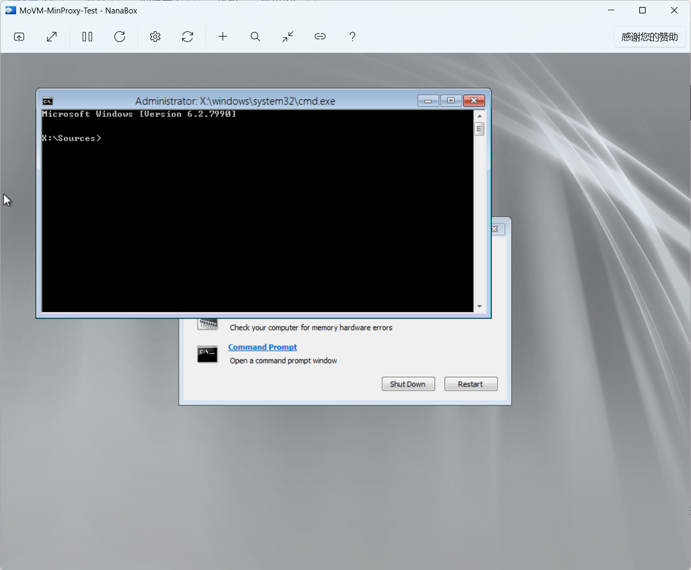
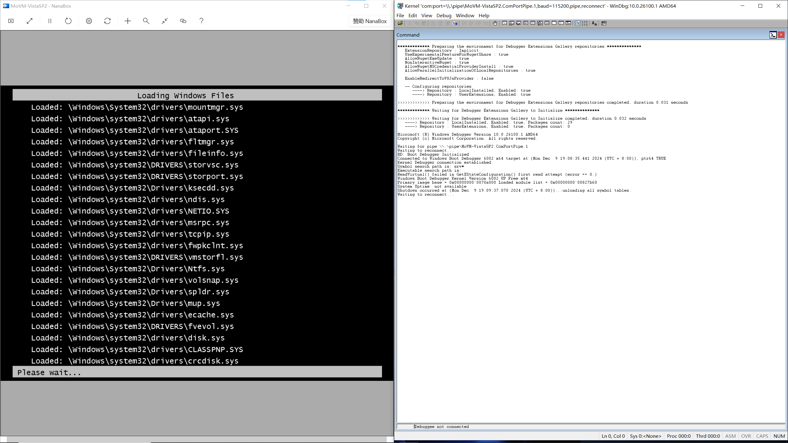

# MD21: Talk about booting Windows 7 Service Pack 1 on Hyper-V Generation 2 Virtual Machines

[简体中文](ReadMe.zh-CN.md)

***Work In Progress***

As the guy who want to write bare-matal applications with as high level
programming languages like C/C++ as possible, I love the design of Hyper-V
Generation 2 Virtual Machines because it's one of validated popular
para-virtualization platforms via history, especially it should be the only
one with aggressive para-virtualization design in current stage:

- No CSM support. Only provides 64-Bit UEFI Class 3 firmware.
- No emulated devices. Only devices based on VMBus are available.
- No legacy x86 devices like the floppy controller, the DMA controller, the
  PCI Bus, the legacy Programmable Interrupt Controller (PIC), the legacy
  Programmable Interval Timer (PIT), and the Super I/O device. Needs guest
  operating systems to adapt explicitly.

It's good for me. I only need to write UEFI applications which only support
Hyper-V Generation 2 Virtual Machines, which is enough for my proof of concept
level ideas. It can help me avoid to adapt to the specific hardwares which need
to write a lot of assembly codes. Also, I love the lightweight design, lol.

Note: The Windows builtin Hyper-V client is really hard to use. It makes me
hesitate, until [Ben (Bingxing) Wang] told me that you can use Hyper-V Host
Compute System API which was newly at that time to implement the third-party
Hyper-V client, especially its stateless design may good for you, and you can
use ILSpy to learn how to use that. I had used several months to implement that
and make it open source at GitHub. If some people need to use the third-party
Hyper-V Host Compute System API created by me, please refer to the [NanaBox]. I
hope that project can help people who have the same feeling as me.

[Ben (Bingxing) Wang]: https://github.com/imbushuo
[NanaBox]: https://github.com/M2Team/NanaBox

As the design of Hyper-V Generation 2 Virtual Machines, 64-Bit Windows 8 and
Windows Server 2012 are the minimum Windows versions which support booting on
Hyper-V Generation 2 Virtual Machines. Also, Microsoft said that in the
[Generation 2 FAQ]:

> Q: Why are 64-bit versions of Windows Server 2008 R2 and Windows 7 not
  supported as generation 2 guest operating systems?

> A: Although Windows Server 2008 R2 and Windows 7 support UEFI, they depend on
  a programmable interrupt controller (PIC), which is not present in generation
  2 virtual machine hardware.

[Generation 2 FAQ]: https://learn.microsoft.com/en-us/previous-versions/windows/it-pro/windows-server-2012-r2-and-2012/dn282285(v=ws.11)#why-are-64-bit-versions-of-windows-server-2008-r2-and-windows-7-not-supported-as-generation-2-guest-operating-systems

But the reason is not enough to persuade me. I had started to do some
experiments to discover the real reason about half a year ago. Finally, I
accidently made booting Windows 7 Service Pack 1 on Hyper-V Generation 2
Virtual Machines. In the following sections, I will talk about the details.

Warning: I have no experience about writing Windows kernel drivers because I
cannot afford the price of the Windows driver signing certificate. Maybe my way
mentioned in this article is too wild and hope you can forgive me.

## Preliminary Information

We need to learn something preliminary before we start the journey.

### Minimum Windows guest build supports Hyper-V Generation 2 Virtual Machines

First, we need to know the actual minimum Windows build which supports booting
on Hyper-V Generation 2 Virtual Machines. It can help us to know how Microsoft
guys adapt to that.

The task is really simple because we only need to test which is the earliest
Windows build can boot on Hyper-V Generation 2 Virtual Machines.

As we all know, 64-Bit Windows 8 and Windows Server 2012 are the minimum Windows
versions which support booting on Hyper-V Generation 2 Virtual Machines. So we
only need to test builds mentioned in [Windows 8 - BetaWiki] and
[Windows Server 2012 - BetaWiki].

[Windows 8 - BetaWiki]: https://betawiki.net/wiki/Windows_8
[Windows Server 2012 - BetaWiki]: https://betawiki.net/wiki/Windows_Server_2012

We can divide these Windows builds into the following categories:

| Levels  | Behavior                                   |
|---------|--------------------------------------------|
| Level 0 | Boot failed with kernel deadloop           |
| Level 1 | Boot failed with ACPI issues               |
| Level 2 | Boot successfully with bootmgr replacement |
| Level 3 | Boot successfully without modifications    |



In the current stage, the minimum level 3 builds I found are Build 7990
(fbl_core1_hyp_dev), Build 8027 (fbl_fun_perf) or Build 8028 (winmain). The
minimum level 2 build I found is Build 8002 (fbl_grfx_dev1).

### Hyper-V guest interfaces definitions

For adapting to Hyper-V Generation 2 Virtual Machines, we need to know the
Hyper-V guest interfaces definitions. I have classified them as the open source
project [Mile.HyperV] and it provides the reference document to show where I get
the definitions.

[Mile.HyperV]: https://github.com/ProjectMile/Mile.HyperV

### ReactOS source code

Because Windows is not open source, we need to learn something about the hal and
ntoskrnl from ReactOS source code. Although the ReactOS x64 hal implementations
are too raw even for learning.

But for appreciating that project which helps me to learn something reliminary.
I also try to make boot ReactOS on Hyper-V Generation 2 Virtual Machines. But
there is no VMBus devices support because the ReactOS implementations are too
raw and lacks lots of things, which I have to use the ReactOS Longhorn
experimental branches. And [The_DarkFire] and [Timo Kreuzer] help me a lot for
learning that.

[The_DarkFire]: https://github.com/DarkFire01
[Timo Kreuzer]: https://github.com/tkreuzer

For people who have the ability to read the ReactOS source code, see
https://github.com/MouriNaruto/reactos/tree/remilia-hyperv-main-longhorn for my
modified branch.

### Suitable Windows versions for adaption

Because the virtual keyboard in Hyper-V Generation 2 Virtual Machines is a VMBus
device, we need to use Hyper-V Integration Services with version 6.2.9200.16385
or later if we want to have good user experience. So, the minimum requirements
for Hyper-V Integration Services with version 6.2.9200.16385 is the baseline for
us to choose the suitable Windows versions for additional adaption:

- 64-Bit Windows 7 RTM or Service Pack 1
- Windows Server 2008 R2 RTM or Service Pack 1
- 64-Bit Windows Vista Service Pack 2
- 64-Bit Windows Server 2008 Service Pack 2
- Windows XP Professional x64 Edition Service Pack 2
- Windows Server 2003 (x64) Service Pack 2

## Start the wild journey

Let's start the wild journey after we have learned the preliminary information.

### Prerequisites

- Install the Windows version you want to adapt to boot on Hyper-V Generation 2
  Virtual Machines in Hyper-V Generation 1 Virtual Machines, but you need to
  prepare a 100 MiB size FAT32 partition for the EFI System Partition (ESP).
- Install the Hyper-V Integration Services with version 6.2.9200.16385 or later.
- WinDbg is necessary for debugging the boot process.
- IDA Pro or similar tool for analyzing and patching.
- PE Tools or similar tool for recalculate the checksum of the modified files.
- Microsoft Copilot or similar services may help you to generate the opcode, lol.

### Create boot files for UEFI boot

After we have done the prerequisites, we need to mount the virtual machine's
hard disk file to your host machine and create the boot files for UEFI boot.

Assumes your mounted Windows partition is "G:" and the ESP partition is "F:".

First, we need to create the boot files for UEFI boot:

```cmd
bcdboot G:\Windows /s F: /f UEFI
```

Then, we need to set the debugging options to the Windows Boot Manager:

```cmd
bcdedit /store F:\EFI\Microsoft\Boot\BCD /bootdebug {default} on
bcdedit /store F:\EFI\Microsoft\Boot\BCD /debug {default} on
bcdedit /store F:\EFI\Microsoft\Boot\BCD /set {default} sos on
bcdedit /store F:\EFI\Microsoft\Boot\BCD /dbgsettings SERIAL DEBUGPORT:1 BAUDRATE:115200 /start ACTIVE
```

I also suggest you to set the boot manager timeout to 30 seconds:

```cmd
bcdedit /store F:\EFI\Microsoft\Boot\BCD /timeout 30
```

### Fix the BugCheck to ensure we can get the error message

If you start your virtual machine, you will see noting after detaching the
Windows Boot Debugger in the WinDbg command window. And you will find the
virtual machine instance process will have the high CPU usage. Some people
will know the OS kernel in the virtual machine is deadlooping.

Here is the screenshot to show that scenario, which uses the 64-Bit Windows
Vista Service Pack 2 as an example:



I find it's caused by BugCheck just for accident. When I tried to add 0xCC (the
opcode int 3) to make every possible effort to debug what cased the deadloop, I
find the virtual machine will reboot automatically with the triple fault when I
add that opcode to the beginning of the KeBugCheckEx function in ntoskrnl.exe.

So, the fix for that is easy. We can report the BugCheck error message to the
Hyper-V, and we can get the error message from the Windows Event Viewer.

According to Hyper-V Guest Crash Enlightenment Interface mentioned in Hypervisor
Top Level Functional Specification. We can write the following C code as the
KeBugCheckEx function implementation:

```c
DECLSPEC_NORETURN void WINAPI KeBugCheckEx(
    ULONG BugCheckCode,
    ULONG_PTR BugCheckParameter1,
    ULONG_PTR BugCheckParameter2,
    ULONG_PTR BugCheckParameter3,
    ULONG_PTR BugCheckParameter4)
{
    // HV_X64_MSR_CRASH_P0
    __writemsr(0x40000100, BugCheckCode);
    // HV_X64_MSR_CRASH_P1
    __writemsr(0x40000101, BugCheckParameter1);
    // HV_X64_MSR_CRASH_P2
    __writemsr(0x40000102, BugCheckParameter2);
    // HV_X64_MSR_CRASH_P3
    __writemsr(0x40000103, BugCheckParameter3);
    // HV_X64_MSR_CRASH_P4
    __writemsr(0x40000104, BugCheckParameter4);
    // HV_X64_MSR_CRASH_CTL with only setting CrashNotify to 1
    __writemsr(0x40000105, 0x8000000000000000);
    _disable();
    __halt();
    return;
}
```

Here is the assembly for the above C code:

```asm
mov r10, rdx
mov eax, ecx
mov edx, ecx
mov ecx, 40000100h
shr rdx, 20h
wrmsr

mov rdx, r10
mov rax, r10
shr rdx, 20h
mov ecx, 40000101h
wrmsr

mov rdx, r8
mov rax, r8
shr rdx, 20h
mov ecx, 40000102h
wrmsr

mov rdx, r9
mov rax, r9
shr rdx, 20h
mov ecx, 40000103h
wrmsr

mov rdx, [rsp+arg_20]
mov ecx, 40000104h
mov rax, rdx
shr rdx, 20h
wrmsr

xor eax, eax
mov edx, 80000000h
mov ecx, 40000105h
wrmsr

cli
hlt

retn 0
```

Use some tools to convert the above assembly to the machine opcode:

```
49 89 D2
89 C8
89 CA
B9 00 01 00 40
48 C1 EA 20
0F 30 

4C 89 D2 
4C 89 D0
48 C1 EA 20
B9 01 01 00 40
0F 30

4C 89 C2
4C 89 C0
48 C1 EA 20
B9 02 01 00 40
0F 30

4C 89 CA
4C 89 C8
48 C1 EA 20
B9 03 01 00 40
0F 30

48 8B 54 24 28
B9 04 01 00 40
48 89 D0
48 C1 EA 20
0F 30

31 C0
BA 00 00 00 80
B9 05 01 00 40
0F 30

FA
F4

C2 00 00
```

When we use tools like IDA Pro to patch the KeBugCheckEx function in
ntoskrnl.exe with the above opcode, use PE Tools to recalculate the
checksum of the modified ntoskrnl.exe, and then replace the original
ntoskrnl.exe with the modified one. We can get the error message from
the Windows Event Viewer.

```xml
<Event xmlns="http://schemas.microsoft.com/win/2004/08/events/event">
  <System>
    <Provider Name="Microsoft-Windows-Hyper-V-Worker" Guid="{51ddfa29-d5c8-4803-be4b-2ecb715570fe}" />
    <EventID>18590</EventID>
    <Version>0</Version>
    <Level>1</Level>
    <Task>0</Task>
    <Opcode>0</Opcode>
    <Keywords>0x8000000000000000</Keywords>
    <TimeCreated SystemTime="2024-12-09T11:31:23.2356205Z" />
    <EventRecordID>35726</EventRecordID>
    <Correlation />
    <Execution ProcessID="1268" ThreadID="3476" />
    <Channel>Microsoft-Windows-Hyper-V-Worker-Admin</Channel>
    <Computer>DESKTOP-OLUNT6J</Computer>
    <Security UserID="S-1-5-83-1-3655396106-1351506743-3915871121-3476744365" />
  </System>
  <UserData>
    <VmlEventLog xmlns="http://www.microsoft.com/Windows/Virtualization/Events">
      <VmName>Virtual Machine</VmName>
      <VmId>D9E0EB0A-5B37-508E-9173-67E9ADE83ACF</VmId>
      <VmErrorCode0>0x79</VmErrorCode0>
      <VmErrorCode1>0x6</VmErrorCode1>
      <VmErrorCode2>0x0</VmErrorCode2>
      <VmErrorCode3>0x0</VmErrorCode3>
      <VmErrorCode4>0x0</VmErrorCode4>
      <VmErrorMessage>
      </VmErrorMessage>
    </VmlEventLog>
  </UserData>
</Event>
```
