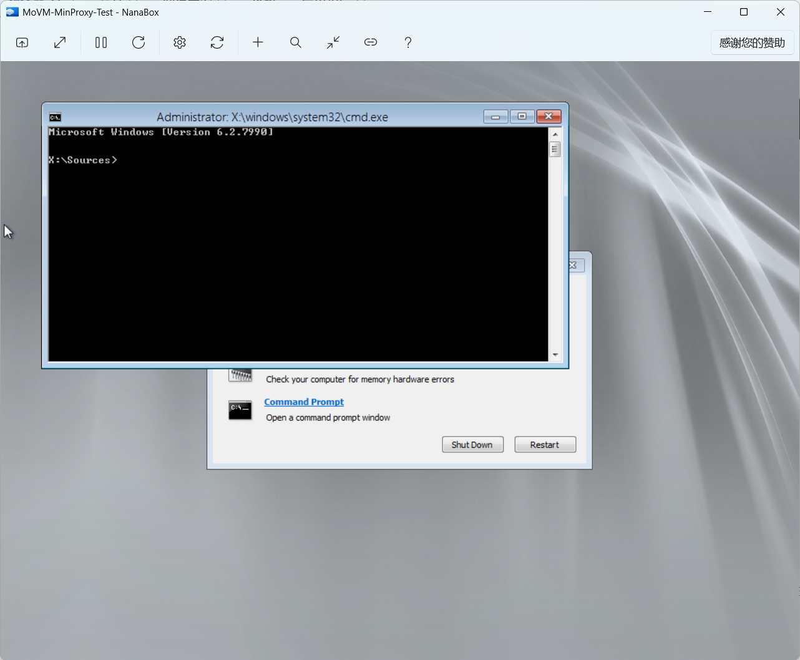
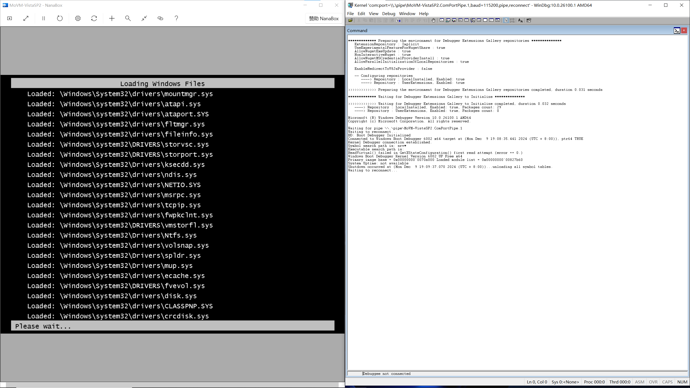
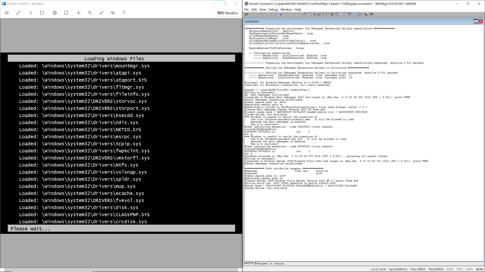
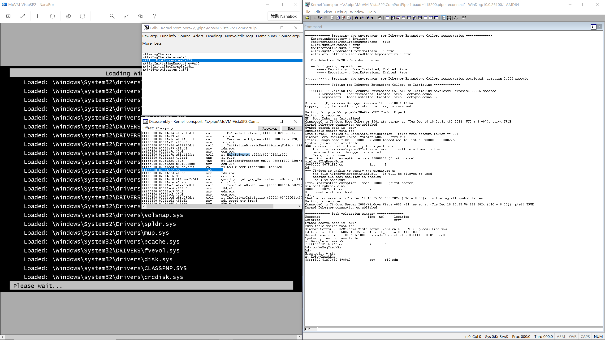
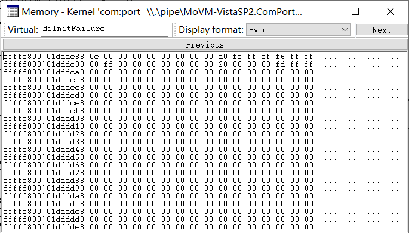
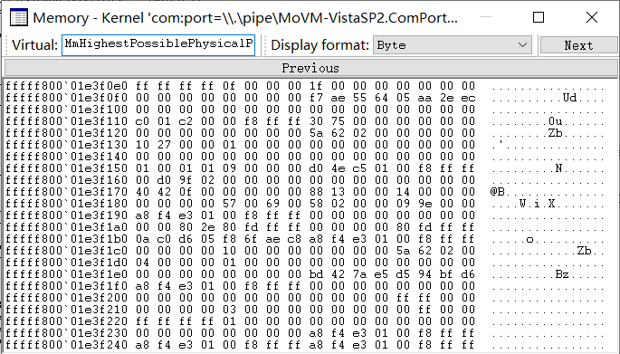
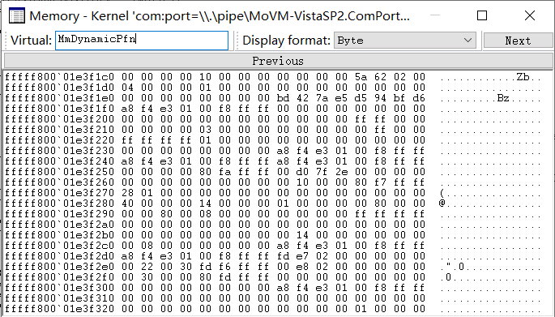
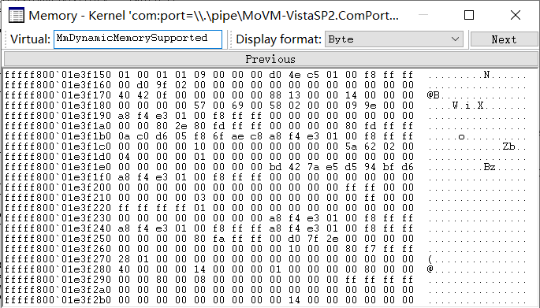
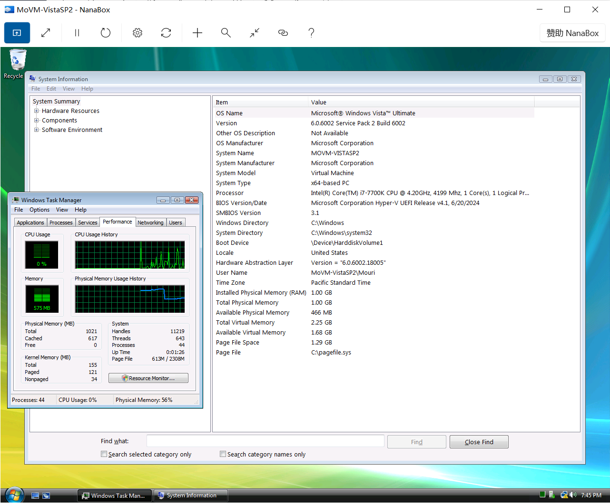
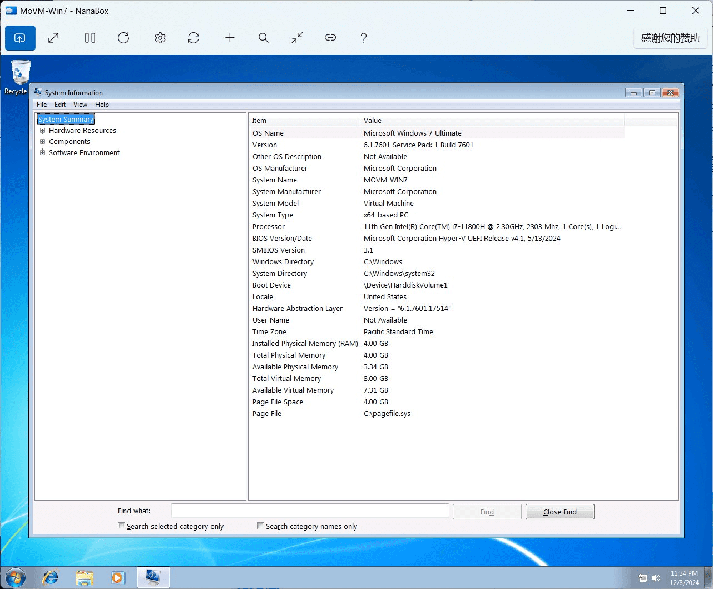

# MD21: 浅谈在 Hyper-V 第二代虚拟机启动 Windows 7 Service Pack 1 的事务

[English](ReadMe.md)

作为一个热衷于尽可能使用像 C/C++ 这样的高级语言编写裸机应用的人，我非常喜欢
Hyper-V 第二代虚拟机的设计，因为这是经过了时间考验的流行的半虚拟化平台之一且看起
来这家伙拥有目前最激进的半虚拟化设计:

- 无 CSM 支持，仅提供 64 位 UEFI Class 3 固件
- 无仿真设备，仅提供基于 VMBus 的设备
- 无软驱控制器、DMA 控制器、PCI 总线、传统可编程中断控制器 (PIC)、传统可编程间隔
  定时器 (PIT) 和超级 I/O 设备这样的传统 x86 设备，需要客户机操作系统明确适配

这样的设计对于我来说是极好的，我只需要编写仅支持 Hyper-V 第二代虚拟机的 UEFI 应
用程序作为原型就足够我向他人展示我的一些想法了。这可以帮助我避免适配需要编写大量
汇编代码的特定硬件。同时，我喜欢这样的轻量级设计 (笑)

注：Windows 自带的 Hyper-V 客户端对我来说很不好用，这使得我在是否选择 Hyper-V 作
为我的裸机应用原型开发平台而陷入了犹豫。直到有一天 [Ben (Bingxing) Wang] 告诉我
你可以使用当时还算新鲜出炉的 Hyper-V Host Compute System API 去实现一个第三方的
Hyper-V 客户端，尤其是这家伙的无状态设计会很合你的胃口，并且你可以通过 ILSpy 去
学习如何使用这家伙。我用了数个月写了一个这样的家伙并且开源到了 GitHub。如果一些
朋友需要使用我编写的基于 Hyper-V Host Compute System API 的第三方客户端，可以参
考 [NanaBox]。我希望该项目能帮助到和我有类似感受的朋友们。

[Ben (Bingxing) Wang]: https://github.com/imbushuo
[NanaBox]: https://github.com/M2Team/NanaBox

以 Hyper-V 第二代虚拟机的设计，支持在 Hyper-V 第二代虚拟机启动的最低版本的 Windows
操作系统是 64 位的 Windows 8 和 Windows Server 2012。并且微软在 [Generation 2 FAQ]
指出:

> Q: Why are 64-bit versions of Windows Server 2008 R2 and Windows 7 not
  supported as generation 2 guest operating systems?

> A: Although Windows Server 2008 R2 and Windows 7 support UEFI, they depend on
  a programmable interrupt controller (PIC), which is not present in generation
  2 virtual machine hardware.

翻译一下中文就是：

> Q: 为什么 64 位的 Windows Server 2008 R2 和 Windows 7 无法在 Hyper-V 第二代虚拟
  机启动？

> A: 虽然 Windows Server 2008 R2 和 Windows 7 支持 UEFI，但它们需要依赖 Hyper-V
  第二代虚拟机上不存在的传统可编程中断控制器 (PIC)。

[Generation 2 FAQ]: https://learn.microsoft.com/en-us/previous-versions/windows/it-pro/windows-server-2012-r2-and-2012/dn282285(v=ws.11)#why-are-64-bit-versions-of-windows-server-2008-r2-and-windows-7-not-supported-as-generation-2-guest-operating-systems

但是这样的理由并不足以说服我。我大约在半年前开始做一些实验去了解其真正的缘由。
最终，我意外地在 Hyper-V 第二代虚拟机上成功启动了 Windows 7 Service Pack 1。
在下面的章节中，我将分享我是如何做到的。

警告：我没有编写 Windows 内核驱动程序的经验，因为我买不起 Windows 驱动程序需要
的签名证书。也许我在本文中提到的方法过于狂野，希望大家见谅。

## 基本常识

在开始之前，我们需要了解一些基本常识：

### 最低支持 Hyper-V 第二代虚拟机的 Windows 客户机版本

首先，我们需要支持实际上支持 Hyper-V 第二代虚拟机的最低的 Windows 客户机版本。这
能帮助我们了解微软那群人是如何进行适配的。

这件事其实非常简单，毕竟我们只需要测试并找出哪个是支持在 Hyper-V 第二代虚拟机上
启动的最老 Windows 版本。

众所周知，64 位 Windows 8 和 Windows Server 2012 是支持在 Hyper-V 第二代虚拟机上
启动的最老版本。于是我们只需要测试 [Windows 8 - BetaWiki] 和
[Windows Server 2012 - BetaWiki] 中提到的 Windows 版本。

[Windows 8 - BetaWiki]: https://betawiki.net/wiki/Windows_8
[Windows Server 2012 - BetaWiki]: https://betawiki.net/wiki/Windows_Server_2012

我们可以把这些 Windows 版本分类成以下类别：

| 级别   | 行为                      |
|--------|---------------------------|
| 级别 0 | 启动失败，内核死锁        |
| 级别 1 | 启动失败，ACPI 报错       |
| 级别 2 | 需要替换 bootmgr 才能启动 |
| 级别 3 | 无需魔改即可启动          |



在目前来看，我发现等级 3 的最小 Windows 版本是 Build 7990
(fbl_core1_hyp_dev)、Build 8027 (fbl_fun_perf) 或者 Build 8028 (winmain)。
我发现的等级 2 的最小 Windows 版本是 Build 8002 (fbl_grfx_dev1)。

### Hyper-V 客户机接口定义

为了适配 Hyper-V 第二代虚拟机，我们需要了解 Hyper-V 客户机接口定义。我已经将相关
信息整理成开源项目 [Mile.HyperV] 并且其提供了我从哪里获取相关定义的参考资料文档。

[Mile.HyperV]: https://github.com/ProjectMile/Mile.HyperV

### ReactOS 源代码

由于 Windows 不开源，于是我们需要从 ReactOS 中学习关于 hal 和 ntoskrnl 的事务。
即使 ReactOS 的 x64 hal 实现哪怕对于学习来说都非常原始。

但是为了感谢该项目帮助了我学习一些基本常识，我也尝试为 ReactOS 添加了 Hyper-V 第
二代虚拟机的支持。但由于 ReactOS 的实现过分原始且缺少一大堆内容，即使使用
ReactOS Longhorn 实验性分支，目前仅能亮机且没有任何的 VMBus 设备支持。当然，
[The_DarkFire] 和 [Timo Kreuzer] 在这里帮了我不少。

[The_DarkFire]: https://github.com/DarkFire01
[Timo Kreuzer]: https://github.com/tkreuzer

对于一些方便阅读 ReactOS 源代码的朋友，可以去
https://github.com/MouriNaruto/reactos/tree/remilia-hyperv-main-longhorn
了解我的魔改分支的内部实现。

### 适合进行适配的 Windows 版本

由于 Hyper-V 第二代虚拟机的虚拟键盘是一个 VMBus 设备，为了体面的用户体验，我们需
要使用 6.2.9200.16385 及之后版本的 Hyper-V 集成服务。于是 6.2.9200.16385 版本的
Hyper-V 集成服务的最低要求是我们选择能够进行额外适配的 Windows 版本的基准线。

- 64 位 Windows 7 RTM 或 Service Pack 1
- Windows Server 2008 R2 RTM 或 Service Pack 1
- 64 位 Windows Vista Service Pack 2
- 64 位 Windows Server 2008 Service Pack 2
- Windows XP Professional x64 Edition Service Pack 2
- Windows Server 2003 (x64) Service Pack 2

## 开始狂野之旅

让我们在了解一些基本常识之后开始我们的狂野之旅吧:

### 前置条件

- 使用 Hyper-V 第一代虚拟机安装你希望适配 Hyper-V 第二代虚拟机的 Windows 版本，
  但是你需要准备一个 100MiB 的 FAT32 格式的分区作为 EFI 系统分区 (ESP)
- 安装 Hyper-V 集成服务 6.2.9200.16385 或更高版本
- WinDbg 对于调试启动过程非常必要
- 类似 IDA Pro 的工具用于分析和修改二进制
- 类似 PE Tools 这样的工具对修改后的文件重新计算校验值
- 类似 Microsoft Copilot 这样的服务也许可以帮你生成用于修改二进制的机器码 (笑)

### 创建 UEFI 启动所需的启动文件

当我们完成了前置条件之后，我们需要挂载虚拟机的虚拟磁盘文件到你的宿主机用于创建
UEFI 启动所需的启动文件。

假定你挂载后的 Windows 分区为 "G:" 和 EFI 系统分区为 "F:"。

首先我们需要创建 UEFI 启动所需的启动文件:

```cmd
bcdboot G:\Windows /s F: /f UEFI
```

然后我们对 Windows 启动管理器启用一些调试设置:

```cmd
bcdedit /store F:\EFI\Microsoft\Boot\BCD /bootdebug {default} on
bcdedit /store F:\EFI\Microsoft\Boot\BCD /debug {default} on
bcdedit /store F:\EFI\Microsoft\Boot\BCD /set {default} sos on
bcdedit /store F:\EFI\Microsoft\Boot\BCD /dbgsettings SERIAL DEBUGPORT:1 BAUDRATE:115200 /start ACTIVE
```

我同时建议你将启动管理器的超时设置为 30 秒:

```cmd
bcdedit /store F:\EFI\Microsoft\Boot\BCD /timeout 30
```

### 修复蓝屏实现以方便我们获取错误信息

如果你这时启动你的虚拟机，你会发现你的 WinDbg 命令窗口中在提示分离 Windows 启动
调试器后没有任何输出。并且你会发现虚拟机实例进程的 CPU 使用率很高。有些人会知道
这是虚拟机内运行的操作系统内核陷入了死循环。

这里是一个使用 64 位 Windows Vista Service Pack 2 作为示例的截图:



其实我也是偶然发现是蓝屏导致的。我当时死马当活马医，尝试以添加 0xCC (int 3 指令
的操作码) 以调试导致死锁的原因，我发现当我将该操作码添加到 ntoskrnl.exe 的
KeBugCheckEx 函数的开头时，虚拟机会发生三重故障并自动重启。

所以，修复这个问题是很容易的。我们可以将 BugCheck 错误消息报告给 Hyper-V，然后我
们可以从 Windows 事件查看器中获取错误消息。

根据 Hyper-V 的 TLFS 规范提到的客户机崩溃报告相关接口，我们可以将以下 C 代码作为
KeBugCheckEx 函数的实现:

```c
DECLSPEC_NORETURN void WINAPI KeBugCheckEx(
    ULONG BugCheckCode,
    ULONG_PTR BugCheckParameter1,
    ULONG_PTR BugCheckParameter2,
    ULONG_PTR BugCheckParameter3,
    ULONG_PTR BugCheckParameter4)
{
    // HV_X64_MSR_CRASH_P0
    __writemsr(0x40000100, BugCheckCode);
    // HV_X64_MSR_CRASH_P1
    __writemsr(0x40000101, BugCheckParameter1);
    // HV_X64_MSR_CRASH_P2
    __writemsr(0x40000102, BugCheckParameter2);
    // HV_X64_MSR_CRASH_P3
    __writemsr(0x40000103, BugCheckParameter3);
    // HV_X64_MSR_CRASH_P4
    __writemsr(0x40000104, BugCheckParameter4);
    // HV_X64_MSR_CRASH_CTL with only setting CrashNotify to 1
    __writemsr(0x40000105, 0x8000000000000000);
    _disable();
    __halt();
    return;
}
```

这是上面 C 代码的汇编实现:

```asm
mov r10, rdx
mov eax, ecx
mov edx, ecx
mov ecx, 40000100h
shr rdx, 20h
wrmsr

mov rdx, r10
mov rax, r10
shr rdx, 20h
mov ecx, 40000101h
wrmsr

mov rdx, r8
mov rax, r8
shr rdx, 20h
mov ecx, 40000102h
wrmsr

mov rdx, r9
mov rax, r9
shr rdx, 20h
mov ecx, 40000103h
wrmsr

mov rdx, [rsp+arg_20]
mov ecx, 40000104h
mov rax, rdx
shr rdx, 20h
wrmsr

xor eax, eax
mov edx, 80000000h
mov ecx, 40000105h
wrmsr

cli
hlt

retn 0
```

使用一些工具将上面的汇编转换为机器码:

```
49 89 D2
89 C8
89 CA
B9 00 01 00 40
48 C1 EA 20
0F 30 

4C 89 D2 
4C 89 D0
48 C1 EA 20
B9 01 01 00 40
0F 30

4C 89 C2
4C 89 C0
48 C1 EA 20
B9 02 01 00 40
0F 30

4C 89 CA
4C 89 C8
48 C1 EA 20
B9 03 01 00 40
0F 30

48 8B 54 24 28
B9 04 01 00 40
48 89 D0
48 C1 EA 20
0F 30

31 C0
BA 00 00 00 80
B9 05 01 00 40
0F 30

FA
F4

C2 00 00
```

当我们使用类似 IDA Pro 这样的工具将 KeBugCheckEx 函数在 ntoskrnl.exe 中的实现替
换为上述机器码后，使用类似 PE Tools 这样的工具重新计算 ntoskrnl.exe 的校验值，
然后替换原始的 ntoskrnl.exe。我们可以从 Windows 事件查看器中获取错误消息。

```xml
<Event xmlns="http://schemas.microsoft.com/win/2004/08/events/event">
  <System>
    <Provider Name="Microsoft-Windows-Hyper-V-Worker" Guid="{51ddfa29-d5c8-4803-be4b-2ecb715570fe}" />
    <EventID>18590</EventID>
    <Version>0</Version>
    <Level>1</Level>
    <Task>0</Task>
    <Opcode>0</Opcode>
    <Keywords>0x8000000000000000</Keywords>
    <TimeCreated SystemTime="2024-12-09T11:31:23.2356205Z" />
    <EventRecordID>35726</EventRecordID>
    <Correlation />
    <Execution ProcessID="1268" ThreadID="3476" />
    <Channel>Microsoft-Windows-Hyper-V-Worker-Admin</Channel>
    <Computer>DESKTOP-OLUNT6J</Computer>
    <Security UserID="S-1-5-83-1-3655396106-1351506743-3915871121-3476744365" />
  </System>
  <UserData>
    <VmlEventLog xmlns="http://www.microsoft.com/Windows/Virtualization/Events">
      <VmName>Virtual Machine</VmName>
      <VmId>D9E0EB0A-5B37-508E-9173-67E9ADE83ACF</VmId>
      <VmErrorCode0>0x79</VmErrorCode0>
      <VmErrorCode1>0x6</VmErrorCode1>
      <VmErrorCode2>0x0</VmErrorCode2>
      <VmErrorCode3>0x0</VmErrorCode3>
      <VmErrorCode4>0x0</VmErrorCode4>
      <VmErrorMessage>
      </VmErrorMessage>
    </VmlEventLog>
  </UserData>
</Event>
```

### 让 Windows 内核调试器可用

根据上述错误信息，我们可以在微软文档中进行搜索，在
[Bug Check 0x79: MISMATCHED_HAL] 中，你会知道这个问题是 hal.dll 导致的，我们需
要对其进行一些二进制修补事务去解决这个问题。

[Bug Check 0x79: MISMATCHED_HAL]: https://learn.microsoft.com/en-us/windows-hardware/drivers/debugger/bug-check-0x79--mismatched-hal

经过一些分析，我发现问题是由 hal.dll 中的 HalpInitMpInfo 函数中的以下伪代码引起
的:

```c
if ( (*(_BYTE *)(HalpApicTable + 40) & 1) == 0 )
    KeBugCheckEx(0x79u, 6ui64, 0i64, 0i64, 0i64);
```

根据 [从 Hyper-V 第二代虚拟机转储的 APIC 表] 的描述，我们知道这只是检查 APIC 表
中的标志。HAL 会在找不到 PC-AT 兼容性位时调用 KeBugCheckEx 函数。

[从 Hyper-V 第二代虚拟机转储的 APIC 表]: https://github.com/MouriNaruto/MouriDocs/blob/main/docs/11/References/ACPI/22621/Disassembled/apic.dsl

我们可以通过 jmp 指令来绕过这个逻辑来修补这个问题。

例如，原始的代码片段是:

```
PAGELK:000007FF3C250CC2 33 FF                                   xor     edi, edi
PAGELK:000007FF3C250CC4 41 F6 44 24 28 01                       test    byte ptr [r12+28h], 1
PAGELK:000007FF3C250CCA 4D 8B F8                                mov     r15, r8
PAGELK:000007FF3C250CCD 44 8B F2                                mov     r14d, edx
PAGELK:000007FF3C250CD0 75 18                                   jnz     short loc_7FF3C250CEA
PAGELK:000007FF3C250CD2 8D 57 06                                lea     edx, [rdi+6]    ; BugCheckParameter1
PAGELK:000007FF3C250CD5 8D 4F 79                                lea     ecx, [rdi+79h]  ; BugCheckCode
PAGELK:000007FF3C250CD8 45 33 C9                                xor     r9d, r9d        ; BugCheckParameter3
PAGELK:000007FF3C250CDB 45 33 C0                                xor     r8d, r8d        ; BugCheckParameter2
PAGELK:000007FF3C250CDE 48 89 7C 24 20                          mov     [rsp+68h+BugCheckParameter4], rdi ; BugCheckParameter4
PAGELK:000007FF3C250CE3 FF 15 1F 88 FE FF                       call    cs:__imp_KeBugCheckEx
PAGELK:000007FF3C250CE3                         ; ---------------------------------------------------------------------------
PAGELK:000007FF3C250CE9 CC                                      align 2
PAGELK:000007FF3C250CEA
PAGELK:000007FF3C250CEA                         loc_7FF3C250CEA:                        ; CODE XREF: HalpInitMpInfo+38↑j
PAGELK:000007FF3C250CEA 3B D7                                   cmp     edx, edi
PAGELK:000007FF3C250CEC 0F 85 75 02 00 00                       jnz     loc_7FF3C250F67
PAGELK:000007FF3C250CF2 48 39 3D 8F 65 FF FF                    cmp     cs:HalpProcLocalApicTable, rdi
PAGELK:000007FF3C250CF9 0F 85 68 02 00 00                       jnz     loc_7FF3C250F67
PAGELK:000007FF3C250CFF 45 8B 44 24 04                          mov     r8d, [r12+4]
PAGELK:000007FF3C250D04 49 8D 54 24 2C                          lea     rdx, [r12+2Ch]
PAGELK:000007FF3C250D09 44 8B CF                                mov     r9d, edi
PAGELK:000007FF3C250D0C 44 8B EF                                mov     r13d, edi
PAGELK:000007FF3C250D0F 8B F7                                   mov     esi, edi
PAGELK:000007FF3C250D11 4D 03 C4                                add     r8, r12
```

我们只需要将 "jnz short loc_7FF3C250CEA" 修改为 "jmp short loc_7FF3C250CEA"。

当然，使用类似的方法去修补 hal.dll 后，我们最终可以在 WinDbg 命令窗口中看到
Windows 内核调试器消息。

这里是一个使用 64 位 Windows Vista Service Pack 2 作为示例的截图:



### 修复 hal.dll 中的计时器缩放实现

在现阶段，你会发现你的虚拟机陷入了死循环。

你通过 WinDbg 进行一些分析后会发现是由 hal.dll 中的 HalpScaleTimers 函数导致的。

我们需要修补 hal.dll 中的 HalpScaleTimers 函数以使其可用。

例如，原始的代码片段是:

```
.text:000007FF3C232060 48 89 5C 24 08                          mov     [rsp+arg_0], rbx
.text:000007FF3C232065 48 89 7C 24 10                          mov     [rsp+arg_8], rdi
.text:000007FF3C23206A 9C                                      pushfq
.text:000007FF3C23206B 48 83 EC 20                             sub     rsp, 20h
.text:000007FF3C23206F 33 C9                                   xor     ecx, ecx
.text:000007FF3C232071 E8 1E F7 FE FF                          call    HalpAcquireCmosSpinLockEx
.text:000007FF3C232076 FA                                      cli
.text:000007FF3C232077 80 3D A2 D4 00 00 00                    cmp     cs:HalpScaleWithPmTimer, 0
.text:000007FF3C23207E 74 55                                   jz      short loc_7FF3C2320D5
.text:000007FF3C232080 E8 DB 67 00 00                          call    HalpProcessorFence
.text:000007FF3C232085 C7 04 25 80 03 FE FF FF                 mov     dword ptr ds:0FFFFFFFFFFFE0380h, 0FFFFFFFFh
.text:000007FF3C232085 FF FF FF
.text:000007FF3C232090 8B 3C 25 90 03 FE FF                    mov     edi, ds:0FFFFFFFFFFFE0390h
.text:000007FF3C232097 0F 31                                   rdtsc
.text:000007FF3C232099 48 C1 E2 20                             shl     rdx, 20h
.text:000007FF3C23209D B9 D3 D3 06 00                          mov     ecx, 6D3D3h
.text:000007FF3C2320A2 48 0B C2                                or      rax, rdx
.text:000007FF3C2320A5 48 8B D8                                mov     rbx, rax
.text:000007FF3C2320A8 E8 B3 B6 FF FF                          call    HalpPmTimerTickCountStall
.text:000007FF3C2320AD E8 AE 67 00 00                          call    HalpProcessorFence
.text:000007FF3C2320B2 44 8B 1C 25 90 03 FE FF                 mov     r11d, ds:0FFFFFFFFFFFE0390h
.text:000007FF3C2320BA 41 2B FB                                sub     edi, r11d
.text:000007FF3C2320BD 0F 31                                   rdtsc
.text:000007FF3C2320BF 48 C1 E2 20                             shl     rdx, 20h
.text:000007FF3C2320C3 C1 E7 03                                shl     edi, 3
.text:000007FF3C2320C6 48 0B C2                                or      rax, rdx
.text:000007FF3C2320C9 48 2B C3                                sub     rax, rbx
.text:000007FF3C2320CC 4C 8B C8                                mov     r9, rax
.text:000007FF3C2320CF 49 C1 E1 03                             shl     r9, 3
.text:000007FF3C2320D3 EB 68                                   jmp     short loc_7FF3C23213D
.text:000007FF3C2320D5                         ; ---------------------------------------------------------------------------
.text:000007FF3C2320D5
.text:000007FF3C2320D5                         loc_7FF3C2320D5:                        ; CODE XREF: HalpScaleTimers+1E↑j
.text:000007FF3C2320D5 C7 04 25 80 03 FE FF FF                 mov     dword ptr ds:0FFFFFFFFFFFE0380h, 0FFFFFFFFh
.text:000007FF3C2320D5 FF FF FF
.text:000007FF3C2320E0 66 BA 70 00                             mov     dx, 70h ; 'p'
.text:000007FF3C2320E4 B0 0A                                   mov     al, 0Ah
.text:000007FF3C2320E6 EE                                      out     dx, al          ; CMOS Memory/RTC Index Register:
.text:000007FF3C2320E6                                                                 ; RTC Register A
.text:000007FF3C2320E7
.text:000007FF3C2320E7                         loc_7FF3C2320E7:                        ; CODE XREF: HalpScaleTimers+8B↓j
.text:000007FF3C2320E7 E4 71                                   in      al, 71h         ; CMOS Memory/RTC Data Register
.text:000007FF3C2320E9 84 C0                                   test    al, al
.text:000007FF3C2320EB 78 FA                                   js      short loc_7FF3C2320E7
.text:000007FF3C2320ED
.text:000007FF3C2320ED                         loc_7FF3C2320ED:                        ; CODE XREF: HalpScaleTimers+91↓j
.text:000007FF3C2320ED E4 71                                   in      al, 71h         ; CMOS Memory/RTC Data Register
.text:000007FF3C2320EF 84 C0                                   test    al, al
.text:000007FF3C2320F1 79 FA                                   jns     short loc_7FF3C2320ED
.text:000007FF3C2320F3 E8 68 67 00 00                          call    HalpProcessorFence
.text:000007FF3C2320F8 0F 31                                   rdtsc
.text:000007FF3C2320FA 8B 3C 25 90 03 FE FF                    mov     edi, ds:0FFFFFFFFFFFE0390h
.text:000007FF3C232101 48 C1 E2 20                             shl     rdx, 20h
.text:000007FF3C232105 48 0B C2                                or      rax, rdx
.text:000007FF3C232108 48 8B D8                                mov     rbx, rax
.text:000007FF3C23210B 66 BA 70 00                             mov     dx, 70h ; 'p'
.text:000007FF3C23210F B0 0A                                   mov     al, 0Ah
.text:000007FF3C232111 EE                                      out     dx, al          ; CMOS Memory/RTC Index Register:
.text:000007FF3C232111                                                                 ; RTC Register A
.text:000007FF3C232112
.text:000007FF3C232112                         loc_7FF3C232112:                        ; CODE XREF: HalpScaleTimers+B6↓j
.text:000007FF3C232112 E4 71                                   in      al, 71h         ; CMOS Memory/RTC Data Register
.text:000007FF3C232114 84 C0                                   test    al, al
.text:000007FF3C232116 78 FA                                   js      short loc_7FF3C232112
.text:000007FF3C232118
.text:000007FF3C232118                         loc_7FF3C232118:                        ; CODE XREF: HalpScaleTimers+BC↓j
.text:000007FF3C232118 E4 71                                   in      al, 71h         ; CMOS Memory/RTC Data Register
.text:000007FF3C23211A 84 C0                                   test    al, al
.text:000007FF3C23211C 79 FA                                   jns     short loc_7FF3C232118
.text:000007FF3C23211E E8 3D 67 00 00                          call    HalpProcessorFence
.text:000007FF3C232123 44 8B 1C 25 90 03 FE FF                 mov     r11d, ds:0FFFFFFFFFFFE0390h
.text:000007FF3C23212B 41 2B FB                                sub     edi, r11d
.text:000007FF3C23212E 0F 31                                   rdtsc
.text:000007FF3C232130 48 C1 E2 20                             shl     rdx, 20h
.text:000007FF3C232134 48 0B C2                                or      rax, rdx
.text:000007FF3C232137 4C 8B C8                                mov     r9, rax
.text:000007FF3C23213A 4C 2B CB                                sub     r9, rbx
.text:000007FF3C23213D
.text:000007FF3C23213D                         loc_7FF3C23213D:                        ; CODE XREF: HalpScaleTimers+73↑j
.text:000007FF3C23213D 65 48 8B 1C 25 18 00 00                 mov     rbx, gs:18h
.text:000007FF3C23213D 00
.text:000007FF3C232146 65 4C 8B 04 25 18 00 00                 mov     r8, gs:18h
.text:000007FF3C232146 00
.text:000007FF3C23214F 49 BA 4B 59 86 38 D6 C5                 mov     r10, 346DC5D63886594Bh
.text:000007FF3C23214F 6D 34
.text:000007FF3C232159 49 8D 89 88 13 00 00                    lea     rcx, [r9+1388h]
.text:000007FF3C232160 49 8B C2                                mov     rax, r10
.text:000007FF3C232163 48 F7 E1                                mul     rcx
.text:000007FF3C232166 8B CF                                   mov     ecx, edi
.text:000007FF3C232168 49 8B C2                                mov     rax, r10
.text:000007FF3C23216B 48 C1 EA 0B                             shr     rdx, 0Bh
.text:000007FF3C23216F 48 81 C1 88 13 00 00                    add     rcx, 1388h
.text:000007FF3C232176 48 69 D2 10 27 00 00                    imul    rdx, 2710h
.text:000007FF3C23217D 48 89 93 C0 00 00 00                    mov     [rbx+0C0h], rdx
.text:000007FF3C232184 48 F7 E1                                mul     rcx
.text:000007FF3C232187 48 B8 DB 34 B6 D7 82 DE                 mov     rax, 431BDE82D7B634DBh
.text:000007FF3C232187 1B 43
.text:000007FF3C232191 48 8B CA                                mov     rcx, rdx
.text:000007FF3C232194 48 C1 E9 0B                             shr     rcx, 0Bh
.text:000007FF3C232198 49 F7 E1                                mul     r9
.text:000007FF3C23219B 69 C9 10 27 00 00                       imul    ecx, 2710h
.text:000007FF3C2321A1 48 C1 EA 12                             shr     rdx, 12h
.text:000007FF3C2321A5 0F BA 64 24 20 09                       bt      [rsp+28h+var_8], 9
.text:000007FF3C2321AB 89 8B DC 00 00 00                       mov     [rbx+0DCh], ecx
.text:000007FF3C2321B1 41 89 50 64                             mov     [r8+64h], edx
.text:000007FF3C2321B5 65 48 8B 04 25 20 00 00                 mov     rax, gs:20h
.text:000007FF3C2321B5 00
.text:000007FF3C2321BE 89 90 F4 05 00 00                       mov     [rax+5F4h], edx
.text:000007FF3C2321C4 89 8B D8 00 00 00                       mov     [rbx+0D8h], ecx
.text:000007FF3C2321CA 89 0C 25 80 03 FE FF                    mov     ds:0FFFFFFFFFFFE0380h, ecx
.text:000007FF3C2321D1 73 01                                   jnb     short loc_7FF3C2321D4
.text:000007FF3C2321D3 FB                                      sti
.text:000007FF3C2321D4
.text:000007FF3C2321D4                         loc_7FF3C2321D4:                        ; CODE XREF: HalpScaleTimers+171↑j
.text:000007FF3C2321D4 E8 8F F5 FE FF                          call    HalpReleaseCmosSpinLock
.text:000007FF3C2321D9 8B 83 DC 00 00 00                       mov     eax, [rbx+0DCh]
.text:000007FF3C2321DF 48 8B 5C 24 30                          mov     rbx, [rsp+28h+arg_0]
.text:000007FF3C2321E4 48 8B 7C 24 38                          mov     rdi, [rsp+28h+arg_8]
.text:000007FF3C2321E9 48 83 C4 20                             add     rsp, 20h
.text:000007FF3C2321ED 59                                      pop     rcx
.text:000007FF3C2321EE C3                                      retn
```

首先我们需要做出以下更改:

- 将 "jz short loc_7FF3C2320D5" 修改为 "jmp short loc_7FF3C2320D5"
- Nop 掉 "js short loc_7FF3C2320E7"
- Nop 掉 "jns short loc_7FF3C2320ED".
- Nop 掉 "js short loc_7FF3C232112".
- Nop 掉 "jns short loc_7FF3C232118".

然后你需要重写以下代码片段:

```
.text:000007FF3C232123 44 8B 1C 25 90 03 FE FF                 mov     r11d, ds:0FFFFFFFFFFFE0390h
.text:000007FF3C23212B 41 2B FB                                sub     edi, r11d
.text:000007FF3C23212E 0F 31                                   rdtsc
.text:000007FF3C232130 48 C1 E2 20                             shl     rdx, 20h
.text:000007FF3C232134 48 0B C2                                or      rax, rdx
.text:000007FF3C232137 4C 8B C8                                mov     r9, rax
.text:000007FF3C23213A 4C 2B CB                                sub     r9, rbx
```

到这样的代码片段:

```
.text:000007FF3C232123 B9 23 00 00 40                          mov     ecx, 40000023h
.text:000007FF3C232128 0F 32                                   rdmsr
.text:000007FF3C23212A 89 C7                                   mov     edi, eax
.text:000007FF3C23212C B9 22 00 00 40                          mov     ecx, 40000022h
.text:000007FF3C232131 0F 32                                   rdmsr
.text:000007FF3C232133 48 C1 E2 20                             shl     rdx, 20h
.text:000007FF3C232137 48 0B C2                                or      rax, rdx
.text:000007FF3C23213A 4C 8B C8                                mov     r9, rax
```

当然，使用类似的方法去修补 hal.dll 后，我们最终会发现我们成功通过了
HalpScaleTimers 阶段，但是我们会在 InitBootProcessor 函数调用 MmInitSystem
函数后看到 BugCheck 错误。

这里是一个使用 64 位 Windows Vista Service Pack 2 作为示例的截图:



### 禁用 ntoskrnl.exe 中的动态分区策略

虽然 MmInitSystem 函数很复杂，但幸运的是我们有一个全局变量 MiInitFailure 用于了
解 MmInitSystem 函数的失败原因。

通过 WinDbg 内存窗口，我们可以知道 MiInitFailure 的值为 14。

这里是一个使用 64 位 Windows Vista Service Pack 2 作为示例的截图:



对于是谁设置了 MiInitFailure 为 14，我们可以在 MmInitNucleus 函数中找到这样的伪
代码:

```c
  PoolWithTag = ExAllocatePoolWithTag(
                  NonPagedPool,
                  4 * ((unsigned __int64)(*(_QWORD *)&MmHighestPossiblePhysicalPage + 32i64) >> 5),
                  0x20206D4Du);
  if ( !PoolWithTag )
  {
    MiInitFailure = 14;
    return 0;
  }
```

通过 WinDbg 内存窗口，我们可以知道 MmHighestPossiblePhysicalPage 的值比我们设置
的虚拟机内存要大得多。

这里是一个使用 64 位 Windows Vista Service Pack 2 作为示例的截图:



对于是谁设置了 MmHighestPossiblePhysicalPage，我们可以在
MiFindLargestLoaderDescriptor 函数中找到这样的伪代码:

```c
  v13 = MmDynamicPfn;
  if ( MmDynamicPfn )
  {
    if ( v5 > MmDynamicPfn - 1 )
      v13 = v5 + 1;
    if ( v13 > 0x1000000000i64 )
      v13 = 0x1000000000i64;
    MmDynamicPfn = v13;
    *(_QWORD *)&MmHighestPossiblePhysicalPage = v13 - 1;
  }
  else
  {
    *(_QWORD *)&MmHighestPossiblePhysicalPage = v5;
  }
```

通过 WinDbg 内存窗口，我们可以知道 MmDynamicPfn 是导致问题的原因。

这里是一个使用 64 位 Windows Vista Service Pack 2 作为示例的截图:



对于是谁设置了 MmDynamicPfn，我们可以在 MiInitializeBootDefaults 函数中找到这样
的伪代码:

```c
  if ( MmDynamicMemorySupported )
  {
    MmDynamicPfn <<= 18;
    if ( !MmDynamicPfn && (int)off_140172A88(17i64, 8i64, &v16, &v15) >= 0 )
      MmDynamicPfn = v16 / 4096;
  }
  else
  {
    MmDynamicPfn = 0i64;
  }
```

哦，看起来是 ntoskrnl.exe 中的动态分区策略导致了 MmInitSystem 函数失败。

这里是一个使用 64 位 Windows Vista Service Pack 2 作为示例的截图:



将 MmDynamicMemorySupported 设置为 0 并不难，只需要对 ntoskrnl.exe 中的
InitializeDynamicPartitioningPolicy 函数进行一些二进制修补事务即可。

例如，原始的代码片段是:

```
INIT:00000001404B40B0 FF F7                                   push    rdi
INIT:00000001404B40B2 48 83 EC 70                             sub     rsp, 70h
INIT:00000001404B40B6 48 8B 05 73 F2 CB FF                    mov     rax, cs:__security_cookie
INIT:00000001404B40BD 48 33 C4                                xor     rax, rsp
INIT:00000001404B40C0 48 89 44 24 60                          mov     [rsp+78h+var_18], rax
INIT:00000001404B40C5 33 D2                                   xor     edx, edx
INIT:00000001404B40C7 4C 8D 44 24 50                          lea     r8, [rsp+78h+var_28]
INIT:00000001404B40CC 8D 7A 01                                lea     edi, [rdx+1]
INIT:00000001404B40CF 8B CF                                   mov     ecx, edi
INIT:00000001404B40D1 E8 3A FF B9 FF                          call    KiCpuId
INIT:00000001404B40D6 0F BA 64 24 58 1F                       bt      [rsp+78h+var_20], 1Fh
INIT:00000001404B40DC 48 8D 4C 24 40                          lea     rcx, [rsp+78h+DestinationString] ; DestinationString
INIT:00000001404B40E1 48 8D 15 08 A1 FF FF                    lea     rdx, aKernelVirtuald ; "Kernel-VirtualDynamicPartitioningSuppor"...
INIT:00000001404B40E8 72 07                                   jb      short loc_1404B40F1
INIT:00000001404B40EA 48 8D 15 5F A1 FF FF                    lea     rdx, aKernelDynamicp ; "Kernel-DynamicPartitioningSupported"
INIT:00000001404B40F1
INIT:00000001404B40F1                         loc_1404B40F1:                          ; CODE XREF: InitializeDynamicPartitioningPolicy+38↑j
INIT:00000001404B40F1 E8 96 AB BA FF                          call    RtlInitUnicodeString
INIT:00000001404B40F6 48 8D 44 24 34                          lea     rax, [rsp+78h+var_44]
INIT:00000001404B40FB 4C 8D 44 24 30                          lea     r8, [rsp+78h+var_48]
INIT:00000001404B4100 48 8D 54 24 38                          lea     rdx, [rsp+78h+var_40]
INIT:00000001404B4105 48 8D 4C 24 40                          lea     rcx, [rsp+78h+DestinationString]
INIT:00000001404B410A 41 B9 04 00 00 00                       mov     r9d, 4
INIT:00000001404B4110 48 89 44 24 20                          mov     [rsp+78h+var_58], rax
INIT:00000001404B4115 E8 86 30 BA FF                          call    ZwQueryLicenseValue
INIT:00000001404B411A 85 C0                                   test    eax, eax
INIT:00000001404B411C 78 34                                   js      short loc_1404B4152
INIT:00000001404B411E 83 7C 24 34 04                          cmp     [rsp+78h+var_44], 4
INIT:00000001404B4123 75 2D                                   jnz     short loc_1404B4152
INIT:00000001404B4125 83 7C 24 38 04                          cmp     [rsp+78h+var_40], 4
INIT:00000001404B412A 75 26                                   jnz     short loc_1404B4152
INIT:00000001404B412C 83 7C 24 30 00                          cmp     [rsp+78h+var_48], 0
INIT:00000001404B4131 74 1F                                   jz      short loc_1404B4152
INIT:00000001404B4133 48 B8 F0 02 00 00 80 F7                 mov     rax, 0FFFFF780000002F0h
INIT:00000001404B4133 FF FF
INIT:00000001404B413D 40 88 3D E2 2E D7 FF                    mov     cs:KeDynamicPartitioningSupported, dil
INIT:00000001404B4144 8B 00                                   mov     eax, [rax]
INIT:00000001404B4146 83 C8 20                                or      eax, 20h
INIT:00000001404B4149 A3 F0 02 00 00 80 F7 FF                 mov     ds:0FFFFF780000002F0h, eax
INIT:00000001404B4149 FF
INIT:00000001404B4152
INIT:00000001404B4152                         loc_1404B4152:                          ; CODE XREF: InitializeDynamicPartitioningPolicy+6C↑j
INIT:00000001404B4152                                                                 ; InitializeDynamicPartitioningPolicy+73↑j
INIT:00000001404B4152                                                                 ; InitializeDynamicPartitioningPolicy+7A↑j
INIT:00000001404B4152                                                                 ; InitializeDynamicPartitioningPolicy+81↑j
INIT:00000001404B4152 4C 8D 44 24 50                          lea     r8, [rsp+78h+var_28]
INIT:00000001404B4157 33 D2                                   xor     edx, edx
INIT:00000001404B4159 8B CF                                   mov     ecx, edi
INIT:00000001404B415B E8 B0 FE B9 FF                          call    KiCpuId
INIT:00000001404B4160 0F BA 64 24 58 1F                       bt      [rsp+78h+var_20], 1Fh
INIT:00000001404B4166 48 8D 4C 24 40                          lea     rcx, [rsp+78h+DestinationString] ; DestinationString
INIT:00000001404B416B 48 8D 15 2E A1 FF FF                    lea     rdx, aKernelVmphysic ; "Kernel-VmPhysicalMemoryAddAllowed"
INIT:00000001404B4172 72 07                                   jb      short loc_1404B417B
INIT:00000001404B4174 48 8D 15 75 A1 FF FF                    lea     rdx, aKernelPhysical ; "Kernel-PhysicalMemoryAddAllowed"
INIT:00000001404B417B
INIT:00000001404B417B                         loc_1404B417B:                          ; CODE XREF: InitializeDynamicPartitioningPolicy+C2↑j
INIT:00000001404B417B E8 0C AB BA FF                          call    RtlInitUnicodeString
INIT:00000001404B4180 48 8D 44 24 34                          lea     rax, [rsp+78h+var_44]
INIT:00000001404B4185 4C 8D 44 24 30                          lea     r8, [rsp+78h+var_48]
INIT:00000001404B418A 48 8D 54 24 38                          lea     rdx, [rsp+78h+var_40]
INIT:00000001404B418F 48 8D 4C 24 40                          lea     rcx, [rsp+78h+DestinationString]
INIT:00000001404B4194 41 B9 04 00 00 00                       mov     r9d, 4
INIT:00000001404B419A 48 89 44 24 20                          mov     [rsp+78h+var_58], rax
INIT:00000001404B419F E8 FC 2F BA FF                          call    ZwQueryLicenseValue
INIT:00000001404B41A4 85 C0                                   test    eax, eax
INIT:00000001404B41A6 78 23                                   js      short loc_1404B41CB
INIT:00000001404B41A8 83 7C 24 34 04                          cmp     [rsp+78h+var_44], 4
INIT:00000001404B41AD 75 1C                                   jnz     short loc_1404B41CB
INIT:00000001404B41AF 83 7C 24 38 04                          cmp     [rsp+78h+var_40], 4
INIT:00000001404B41B4 75 15                                   jnz     short loc_1404B41CB
INIT:00000001404B41B6 0F B6 05 93 2F D7 FF                    movzx   eax, cs:MmDynamicMemorySupported
INIT:00000001404B41BD 83 7C 24 30 00                          cmp     [rsp+78h+var_48], 0
INIT:00000001404B41C2 0F 45 C7                                cmovnz  eax, edi
INIT:00000001404B41C5 88 05 85 2F D7 FF                       mov     cs:MmDynamicMemorySupported, al
INIT:00000001404B41CB
INIT:00000001404B41CB                         loc_1404B41CB:                          ; CODE XREF: InitializeDynamicPartitioningPolicy+F6↑j
INIT:00000001404B41CB                                                                 ; InitializeDynamicPartitioningPolicy+FD↑j
INIT:00000001404B41CB                                                                 ; InitializeDynamicPartitioningPolicy+104↑j
INIT:00000001404B41CB 48 8B 4C 24 60                          mov     rcx, [rsp+78h+var_18]
INIT:00000001404B41D0 48 33 CC                                xor     rcx, rsp        ; StackCookie
INIT:00000001404B41D3 E8 78 3C BC FF                          call    __security_check_cookie
INIT:00000001404B41D8 48 83 C4 70                             add     rsp, 70h
INIT:00000001404B41DC 5F                                      pop     rdi
INIT:00000001404B41DD C3                                      retn
```

将 "js short loc_1404B41CB" 修改为 "jmp short loc_1404B41CB"。

我们同时也应该将 "js short loc_1404B4152" 修改为 "jmp short loc_1404B4152"。

当然，使用类似的方法去修补 ntoskrnl.exe 后，你可以从 Windows 事件查看器中获取到
ACPI BugCheck 错误消息。

```xml
<Event xmlns="http://schemas.microsoft.com/win/2004/08/events/event">
  <System>
    <Provider Name="Microsoft-Windows-Hyper-V-Worker" Guid="{51ddfa29-d5c8-4803-be4b-2ecb715570fe}" />
    <EventID>18590</EventID>
    <Version>0</Version>
    <Level>1</Level>
    <Task>0</Task>
    <Opcode>0</Opcode>
    <Keywords>0x8000000000000000</Keywords>
    <TimeCreated SystemTime="2024-12-10T03:35:57.3269133Z" />
    <EventRecordID>35780</EventRecordID>
    <Correlation />
    <Execution ProcessID="7016" ThreadID="708" />
    <Channel>Microsoft-Windows-Hyper-V-Worker-Admin</Channel>
    <Computer>DESKTOP-OLUNT6J</Computer>
    <Security UserID="S-1-5-83-1-3655396106-1351506743-3915871121-3476744365" />
  </System>
  <UserData>
    <VmlEventLog xmlns="http://www.microsoft.com/Windows/Virtualization/Events">
      <VmName>Virtual Machine</VmName>
      <VmId>D9E0EB0A-5B37-508E-9173-67E9ADE83ACF</VmId>
      <VmErrorCode0>0xa5</VmErrorCode0>
      <VmErrorCode1>0x11</VmErrorCode1>
      <VmErrorCode2>0x6</VmErrorCode2>
      <VmErrorCode3>0x0</VmErrorCode3>
      <VmErrorCode4>0x0</VmErrorCode4>
      <VmErrorMessage>
      </VmErrorMessage>
    </VmlEventLog>
  </UserData>
</Event>
```

但如果你尝试在 Hyper-V 第二代虚拟机上启动 Windows Vista Service Pack 2，你会遇到
死锁。这是 HalInitSystem 函数中的以下伪代码片段导致的:

```c
    if ( HalpHpetInitialized )
    {
      HalpStallExecutionProcessorSource = 4;
      HalpQueryPerformanceCounterSource = 4;
    }
    else
    {
      HalpStallExecutionProcessorSource = 2;
      HalpQueryPerformanceCounterSource = 2;
    }
```

例如，原始的代码片段是:

```
PAGELK:000007FF3C251AF2                         loc_7FF3C251AF2:                        ; CODE XREF: HalInitSystem+CA↑j
PAGELK:000007FF3C251AF2 B8 02 00 00 00                          mov     eax, 2
PAGELK:000007FF3C251AF7 89 05 C7 31 FF FF                       mov     cs:HalpStallExecutionProcessorSource, eax
PAGELK:000007FF3C251AFD 89 05 B5 31 FF FF                       mov     cs:HalpQueryPerformanceCounterSource, eax
```

将 "mov eax, 2" 修改为 "mov eax, 1"。

当然，使用类似的方法去修补 hal.dll 后，你将会看到和在 Hyper-V 第二代虚拟机启动
Windows 7 Service Pack 1 时相同的结果。

### 修复 ACPI BugCheck 问题

根据上述错误信息，我们可以在微软文档中进行搜索，在
[Bug Check 0xA5: ACPI_BIOS_ERROR] 中，你会知道这个问题是 acpi.sys 导致的，我们需
要对其进行一些二进制修补事务去解决这个问题。

[Bug Check 0xA5: ACPI_BIOS_ERROR]: https://learn.microsoft.com/en-us/windows-hardware/drivers/debugger/bug-check-0xa5--acpi-bios-error

经过一些分析，我发现这个问题是由 acpi.sys 中的 ACPIEnableEnterACPIMode 函数的以
下伪代码导致的:

```c
  v3 = 0x1E8480 % TimeIncrement;
  v4 = MEMORY[0xFFFFF78000000320];
  v5 = MEMORY[0xFFFFF78000000320] + 0x1E8480 / TimeIncrement;
  while ( (READ_PM1_CONTROL(v4, v3) & 1) == 0 )
  {
    if ( MEMORY[0xFFFFF78000000320] > v5 )
      KeBugCheckEx(0xA5u, 0x11ui64, 6ui64, 0i64, 0i64);
  }
```

我们知道 Hyper-V 第二代虚拟机是现代虚拟机，所以，我猜测 Hyper-V 第二代虚拟机中的
ACPI 全程启用并无法禁用。所以，我们只需要绕过这个逻辑。

例如，原始的代码片段是:

```
.text:0000000000025930 48 89 5C 24 08                          mov     [rsp+arg_0], rbx
.text:0000000000025935 48 89 74 24 10                          mov     [rsp+arg_8], rsi
.text:000000000002593A 57                                      push    rdi
.text:000000000002593B 48 83 EC 30                             sub     rsp, 30h
.text:000000000002593F 40 32 FF                                xor     dil, dil
.text:0000000000025942 84 C9                                   test    cl, cl
.text:0000000000025944 75 16                                   jnz     short loc_2595C
.text:0000000000025946 44 0F 20 C0                             mov     rax, cr8
.text:000000000002594A 3C 02                                   cmp     al, 2
.text:000000000002594C 73 0E                                   jnb     short loc_2595C
.text:000000000002594E B9 01 00 00 00                          mov     ecx, 1          ; Affinity
.text:0000000000025953 FF 15 AF 89 01 00                       call    cs:__imp_KeSetSystemAffinityThread
.text:0000000000025959 40 B7 01                                mov     dil, 1
.text:000000000002595C
.text:000000000002595C                         loc_2595C:                              ; CODE XREF: ACPIEnableEnterACPIMode+14↑j
.text:000000000002595C                                                                 ; ACPIEnableEnterACPIMode+1C↑j
.text:000000000002595C FF 15 AE 89 01 00                       call    cs:__imp_KeQueryTimeIncrement
.text:0000000000025962 48 8B 0D E7 04 02 00                    mov     rcx, cs:AcpiInformation
.text:0000000000025969 48 8B 51 08                             mov     rdx, [rcx+8]
.text:000000000002596D 8B D8                                   mov     ebx, eax
.text:000000000002596F 44 0F B6 42 34                          movzx   r8d, byte ptr [rdx+34h]
.text:0000000000025974 33 D2                                   xor     edx, edx
.text:0000000000025976 8D 4A 08                                lea     ecx, [rdx+8]
.text:0000000000025979 FF 15 F9 E7 01 00                       call    cs:AcpiWriteRegisterRoutine
.text:000000000002597F 33 D2                                   xor     edx, edx
.text:0000000000025981 B8 80 84 1E 00                          mov     eax, 1E8480h
.text:0000000000025986 F7 F3                                   div     ebx
.text:0000000000025988 48 BE 20 03 00 00 80 F7                 mov     rsi, 0FFFFF78000000320h
.text:0000000000025988 FF FF
.text:0000000000025992 48 8B 0E                                mov     rcx, [rsi]
.text:0000000000025995 8B D8                                   mov     ebx, eax
.text:0000000000025997 48 03 D9                                add     rbx, rcx
.text:000000000002599A EB 08                                   jmp     short loc_259A4
.text:000000000002599C                         ; ---------------------------------------------------------------------------
.text:000000000002599C
.text:000000000002599C                         loc_2599C:                              ; CODE XREF: ACPIEnableEnterACPIMode+7B↓j
.text:000000000002599C 48 8B 06                                mov     rax, [rsi]
.text:000000000002599F 48 3B C3                                cmp     rax, rbx
.text:00000000000259A2 77 24                                   ja      short loc_259C8
.text:00000000000259A4
.text:00000000000259A4                         loc_259A4:                              ; CODE XREF: ACPIEnableEnterACPIMode+6A↑j
.text:00000000000259A4 E8 A7 01 00 00                          call    READ_PM1_CONTROL
.text:00000000000259A9 A8 01                                   test    al, 1
.text:00000000000259AB 74 EF                                   jz      short loc_2599C
.text:00000000000259AD 40 84 FF                                test    dil, dil
.text:00000000000259B0 74 06                                   jz      short loc_259B8
.text:00000000000259B2 FF 15 60 89 01 00                       call    cs:__imp_KeRevertToUserAffinityThread
.text:00000000000259B8
.text:00000000000259B8                         loc_259B8:                              ; CODE XREF: ACPIEnableEnterACPIMode+80↑j
.text:00000000000259B8 48 8B 5C 24 40                          mov     rbx, [rsp+38h+arg_0]
.text:00000000000259BD 48 8B 74 24 48                          mov     rsi, [rsp+38h+arg_8]
.text:00000000000259C2 48 83 C4 30                             add     rsp, 30h
.text:00000000000259C6 5F                                      pop     rdi
.text:00000000000259C7 C3                                      retn
.text:00000000000259C8                         ; ---------------------------------------------------------------------------
.text:00000000000259C8
.text:00000000000259C8                         loc_259C8:                              ; CODE XREF: ACPIEnableEnterACPIMode+72↑j
.text:00000000000259C8 48 83 64 24 20 00                       and     [rsp+38h+var_18], 0
.text:00000000000259CE 45 33 C9                                xor     r9d, r9d        ; BugCheckParameter3
.text:00000000000259D1 B9 A5 00 00 00                          mov     ecx, 0A5h       ; BugCheckCode
.text:00000000000259D6 41 8D 51 11                             lea     edx, [r9+11h]   ; BugCheckParameter1
.text:00000000000259DA 45 8D 41 06                             lea     r8d, [r9+6]     ; BugCheckParameter2
.text:00000000000259DE FF 15 F4 89 01 00                       call    cs:__imp_KeBugCheckEx
.text:00000000000259DE                         ; ---------------------------------------------------------------------------
.text:00000000000259E4 CC                                      db 0CCh
```

将下面的代码片段:

```
.text:00000000000259A4                         loc_259A4:                              ; CODE XREF: ACPIEnableEnterACPIMode+6A↑j
.text:00000000000259A4 E8 A7 01 00 00                          call    READ_PM1_CONTROL
.text:00000000000259A9 A8 01                                   test    al, 1
.text:00000000000259AB 74 EF                                   jz      short loc_2599C
.text:00000000000259AD 40 84 FF                                test    dil, dil
.text:00000000000259B0 74 06                                   jz      short loc_259B8
.text:00000000000259B2 FF 15 60 89 01 00                       call    cs:__imp_KeRevertToUserAffinityThread
```

修改为:

```
.text:00000000000259A4                         loc_259A4:                              ; CODE XREF: ACPIEnableEnterACPIMode+6A↑j
.text:00000000000259A4 90                                      nop
.text:00000000000259A5 90                                      nop
.text:00000000000259A6 90                                      nop
.text:00000000000259A7 90                                      nop
.text:00000000000259A8 90                                      nop
.text:00000000000259A9 90                                      nop
.text:00000000000259AA 90                                      nop
.text:00000000000259AB 90                                      nop
.text:00000000000259AC 90                                      nop
.text:00000000000259AD 40 84 FF                                test    dil, dil
.text:00000000000259B0 74 06                                   jz      short loc_259B8
.text:00000000000259B2 FF 15 60 89 01 00                       call    cs:__imp_KeRevertToUserAffinityThread
```

当然，使用类似的方法去修补 acpi.sys 后，你可以从 Windows 事件查看器中获取到
BugCheck 错误消息。

```xml
<Event xmlns="http://schemas.microsoft.com/win/2004/08/events/event">
  <System>
    <Provider Name="Microsoft-Windows-Hyper-V-Worker" Guid="{51ddfa29-d5c8-4803-be4b-2ecb715570fe}" />
    <EventID>18590</EventID>
    <Version>0</Version>
    <Level>1</Level>
    <Task>0</Task>
    <Opcode>0</Opcode>
    <Keywords>0x8000000000000000</Keywords>
    <TimeCreated SystemTime="2024-12-10T08:13:13.6675583Z" />
    <EventRecordID>35797</EventRecordID>
    <Correlation />
    <Execution ProcessID="5928" ThreadID="7620" />
    <Channel>Microsoft-Windows-Hyper-V-Worker-Admin</Channel>
    <Computer>DESKTOP-OLUNT6J</Computer>
    <Security UserID="S-1-5-83-1-3655396106-1351506743-3915871121-3476744365" />
  </System>
  <UserData>
    <VmlEventLog xmlns="http://www.microsoft.com/Windows/Virtualization/Events">
      <VmName>Virtual Machine</VmName>
      <VmId>D9E0EB0A-5B37-508E-9173-67E9ADE83ACF</VmId>
      <VmErrorCode0>0x7b</VmErrorCode0>
      <VmErrorCode1>0xfffffa60005959c0</VmErrorCode1>
      <VmErrorCode2>0xffffffffc0000034</VmErrorCode2>
      <VmErrorCode3>0x0</VmErrorCode3>
      <VmErrorCode4>0x0</VmErrorCode4>
      <VmErrorMessage>
      </VmErrorMessage>
    </VmlEventLog>
  </UserData>
</Event>
```

### 进入桌面

根据上述错误信息，我们可以在微软文档中进行搜索，在
[Bug check 0x7B: INACCESSIBLE_BOOT_DEVICE] 中，我们将会知道只要能让内核找到启动
设备就可以达成我们的目标了。

[Bug check 0x7B: INACCESSIBLE_BOOT_DEVICE]: https://learn.microsoft.com/en-us/windows-hardware/drivers/debugger/bug-check-0x7b--inaccessible-boot-device

实际上，我们需要挂载 SYSTEM 注册表单元以修改一些注册表键:

- 对 ControlSet* 键树设置 NTFS 文件系统驱动程序为在启动时启动
- 检查 ControlSet* 键树中的 Control 键中的 FirmwareBootDevice 路径值，确保它是正
  确的路径

搞定这些后，我们就可以成功地进入桌面了。

但是对于 Windows Vista Service Pack 2 和 Windows 7 Service Pack 1 的第一次启动，
我们将看不到桌面，因为 Hyper-V 合成视频驱动程序没有加载。

所以，我建议在开始这次狂野之旅之前为你要适配的操作系统安装 [NanaRun] 中的
SynthRdp 工具，这样你就有 机会使用 Hyper-V 增强会话模式了。

[NanaRun]: https://github.com/M2Team/NanaRun

这是我最终的截图:





## 总结

本文最终得到的原因相对于微软的 [Generation 2 FAQ] 中提到的还是有些复杂和不同:

- ACPI APIC 表没有设置 PC-AT 兼容位
- ACPI 计时器存在，但无法通过 ACPI FACP 表的 PM Timer Block Address 区域获取，并
  且 Windows 仅使用 ACPI 计时器对其他计时器进行缩放，除非你整了点二进制修补。看
  起来旧版 Windows 真的很喜欢 ACPI 计时器，Windows Vista 就是一个例子。同时，旧
  版 Windows 不会检查 ACPI FADT 表中的通用地址结构中的 PM 计时器块地址，而实际上
  Hyper-V 第二代虚拟机提供了相关值
- 旧版 Windows 内核只会根据是否是特定的 Windows 版本决定是否启用动态分区策略，而
  不会检查动态分区策略在实际环境的可用性

## 后记

原本我使用 Windows Vista Service Pack 2 作为本文的示例，只是为了验证本文中提到的
步骤。但看起来 Windows Vista Service Pack 2 也可以用类似的修补方式在 Hyper-V 第
二代虚拟机上成功启动。我认为这是本文的一个很好的例子。

对于 Windows XP x64 Edition Service Pack 2，我在结合 Windows Server 2008 Beta 3
Build 6001.16497 的 bootmgr 和 winload 的基础上使用了一些类似的步骤使得在 
Hyper-V 第二代虚拟机上也可以使用内核调试器。但是存在导致虚拟机陷入死循环的一些问
题，我目前还不知道原因。

但这些例子只是为了写这篇文章来证明我做过的事情。在我看来，如果你想使用本文中提到
的方法来处理你的日常事务，至少你需要基于 [EfiGuard] 制作一个补丁程序。

[EfiGuard]: https://github.com/Mattiwatti/EfiGuard

对于一些想知道我为什么写这篇文章的人，我只是想知道为什么罢了。同时，这也可以帮助
我避免使用 Windows 内置的 Hyper-V 客户端，因为它真的很难用。我终于可以使用我自己
写的 Hyper-V 客户端来运行一些旧版 Windows 以测试我一些开源项目。

希望这篇文章对你有所帮助。
