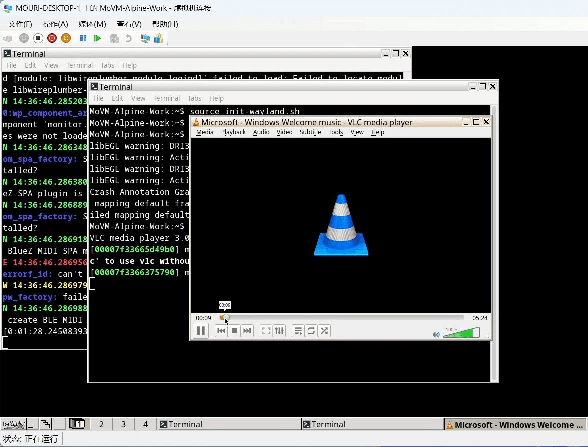
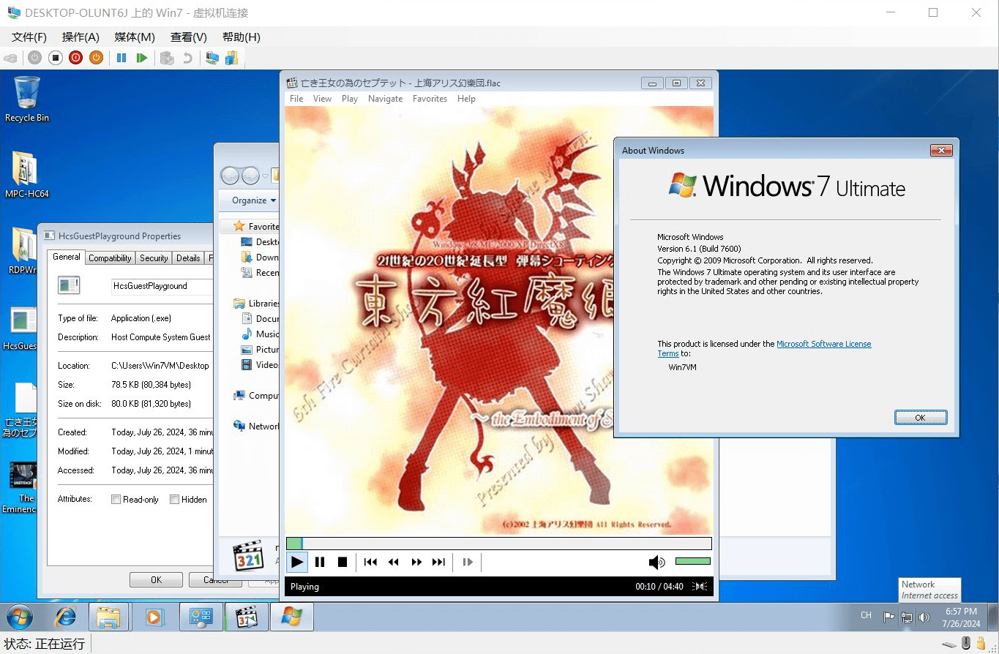
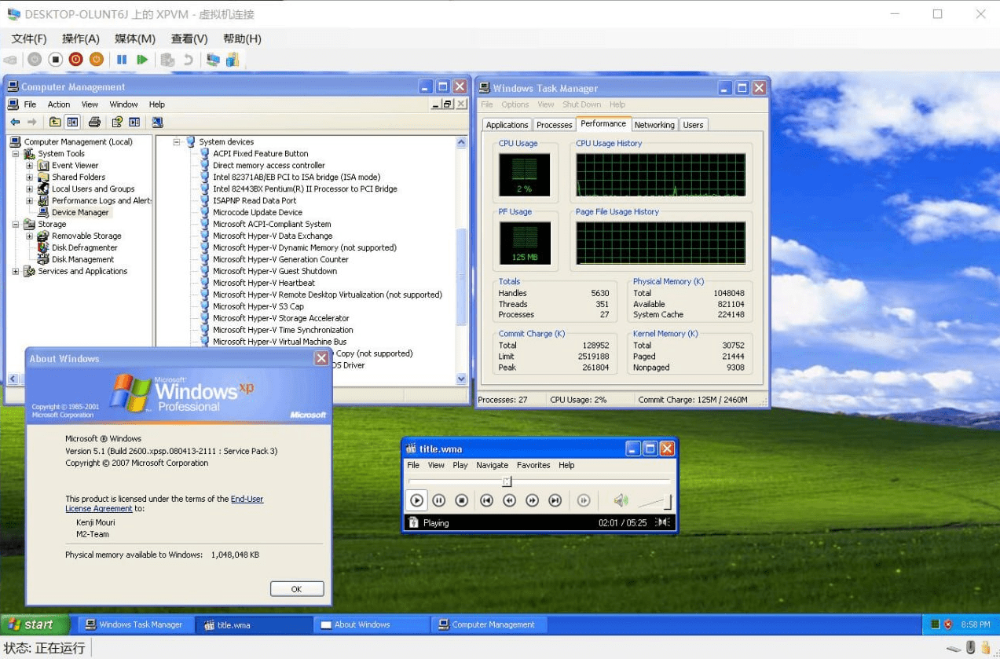
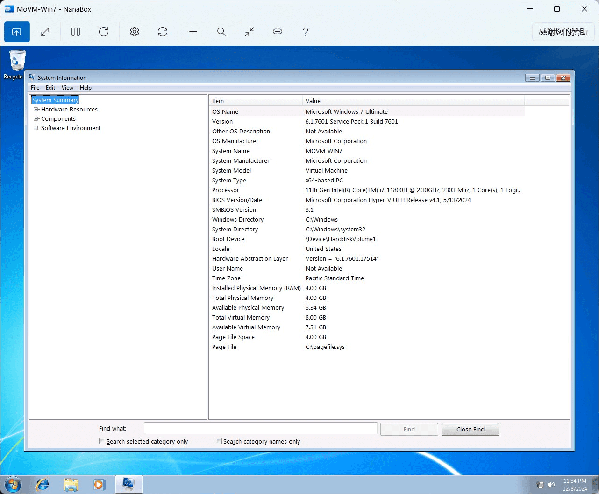
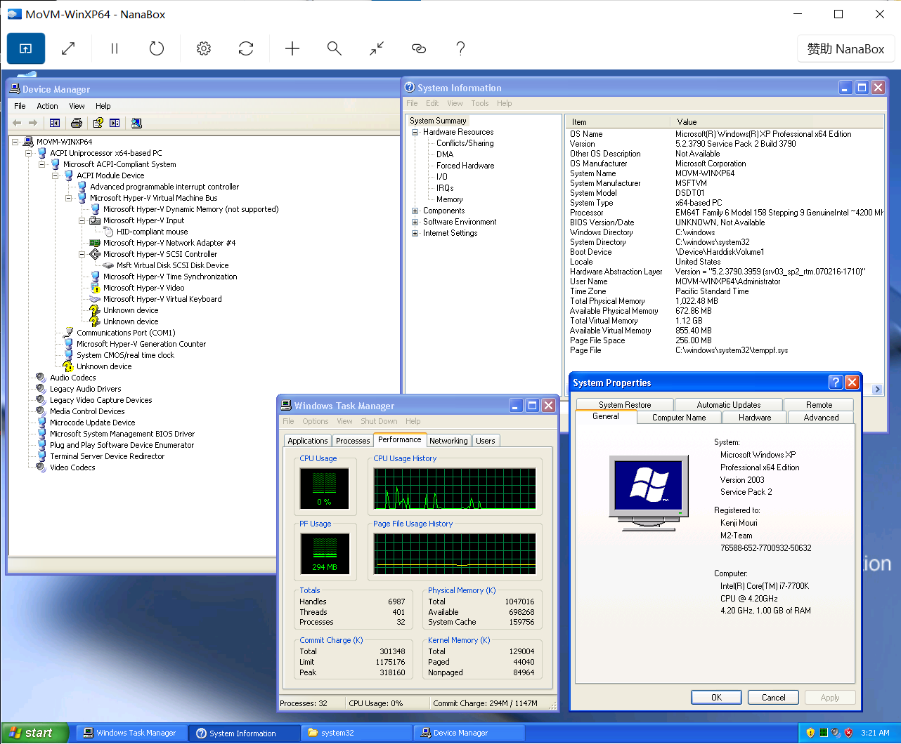
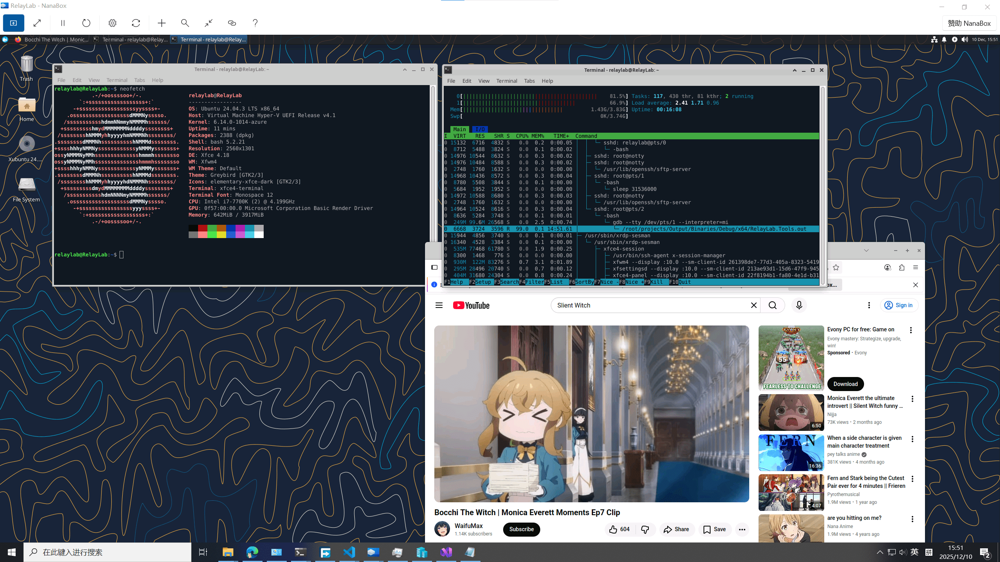

# MD9: Hyper-V Enhanced Session over VMBus for pre-Windows 8.1 and Linux guests

**Work In Progress.**

According to [Use local resources on Hyper-V virtual machine with VMConnect
(Last updated on 02/16/2023)], we will know that to be able to use the official
Hyper-V Enhanced Session support, needs the virtual machine must have Remote
Desktop Services enabled, and run Windows 8.1 / Server 2012 R2 or later as the
guest operating system.

Also, according to [Onboarding: Ubuntu wiki document in Microsoft archived
linux-vm-tools GitHub repository], we will know that Linux guests with xrdp
installed can also use the official Hyper-V Enhanced Session support, which
needs to set the virtual machine uses the Hyper-V Socket transport mode for
Hyper-V Enhanced Session via setting by Hyper-V PowerShell cmdlet.

I don't think the current official policy is user friendly for Hyper-V users,
especially for people who want to use Linux as the guest operating system on
Hyper-V. This is why I want to explore the possibility to implement Hyper-V
Enhanced Session over VMBus for pre-Windows 8.1 and Linux guests.

I'm lucky due to my hard research, finally I archived the goal successfully. So,
I write this document to share my research and implementation experience.

## Technical Details

Hyper-V Enhanced Session over VMBus can be understood as RDP (Remote Desktop
Protocol) without encryption transported over VMBus via the SynthRdp VMBus
channels, which makes VMMS (Virtual Machine Management Service) in Hyper-V Host
easily to wrap it with TLS encryption directly, that mechanism is called RDP
with CredSSP (Credential Security Support Provider), which provides secure
connections to other users want to connect to the virtual machine.

[TermServiceCapture.apmx64] is file contains captured RDP (Remote Desktop
Protocol) without encryption transported over VMBus packets via [API Monitor], I
think it will be helpful for people who want to understand Hyper-V Enhanced
Session over VMBus and RDP (Remote Desktop Protocol).

If you want to use Hyper-V Enhanced Session over VMBus, you need to follow this
negotiation flow in the Guest OS side:

> [!NOTE]
> - Read [Mile.HyperV.VMBus.h in Mile.HyperV] to know the SynthRdp VMBus
>   protocol definitions.
> - Read [Mile.HyperV.Windows.VMBusPipe.h in Mile.HyperV] to know the Hyper-V
>   Windows VMBus User Mode Pipe API definitions, which can help you implement
>   Hyper-V VMBus channel communications in Windows user mode applications.
> - Read [Mile.HyperV.Guest.Protocols.h in Mile.HyperV] to know the raw Hyper-V
>   VMBus packet protocol definitions, which can help you implement Hyper-V
>   VMBus channel communications in Linux user mode applications with
>   [uio_hv_generic kernel module in Linux kernel].

- Listen on the Microsoft Hyper-V Remote Desktop Control Channel, which is a
  VMBus channel class with GUID `{F8E65716-3CB3-4A06-9A60-1889C5CCCAB5}`.
- If the Hyper-V Host supports Hyper-V Enhanced Session over VMBus, the Hyper-V
  Host will connect to the control channel you previously listened with instance
  GUID `{99221FA0-24AD-11E2-BE98-001AA01BBF6E}`.
- You need to send `SYNTHRDP_VERSION_REQUEST_MESSAGE` packet and the Hyper-V
  Host will reply with `SYNTHRDP_VERSION_RESPONSE_MESSAGE` packet.
- If the `IsAccepted` field in `SYNTHRDP_VERSION_RESPONSE_MESSAGE` packet is
  `SYNTHRDP_TRUE_WITH_VERSION_EXCHANGE`, it means the Hyper-V Host supports
  Hyper-V Enhanced Session over VMBus, then you should keep the control channel
  opened.
- You can listen on the Microsoft Hyper-V Remote Desktop Data Channel, which is
  a VMBus channel class with GUID `{F9E9C0D3-B511-4A48-8046-D38079A8830C}`. Or
  learn me to write a try-open-loop due to Microsoft Hyper-V Remote Desktop Data
  Channel has the five instance GUIDs below:
  - `{99221FA1-24AD-11E2-BE98-001AA01BBF6E}`
  - `{99221FA2-24AD-11E2-BE98-001AA01BBF6E}`
  - `{99221FA3-24AD-11E2-BE98-001AA01BBF6E}`
  - `{99221FA4-24AD-11E2-BE98-001AA01BBF6E}`
  - `{99221FA5-24AD-11E2-BE98-001AA01BBF6E}`
- If the user wants to use Hyper-V Enhanced Session over VMBus, the Hyper-V Host
  will connect to one of the instance GUIDs of the data channel you previously
  listened, which makes you can successfully open one of the instance GUIDs of
  the data channel, then you need to make a proxy to redirect RDP (Remote
  Desktop Protocol) packets to the RDP server in the Guest OS a.k.a. local side.
  Due to Hyper-V Host will redirect RDP (Remote Desktop Protocol) without
  encryption packets without any modification, you may need to modify the first
  RDP (Remote Desktop Protocol) packet a.k.a. [Client X.224 Connection Request
  PDU] from the Hyper-V Host. You need to change [requestedProtocols field in
  RDP Negotiation Request (RDP_NEG_REQ)] from `0x0000000B` to `0x00000000`,
  which is `PROTOCOL_SSL | PROTOCOL_HYBRID | PROTOCOL_HYBRID_EX` to
  `PROTOCOL_RDP`, that can make the RDP server in the Guest OS can handle the
  connection request successfully.

## Available Implementations

- For Windows XP / Server 2003 / Vista / Server 2008 / 7 / Server 2008 R2 / 8 /
  Server 2012 guests, I had implemented a tool called SynthRdp, you can get the
  source code and prebuilt binaries from [NanaRun] GitHub repository.
- For Linux guests, I had implemented a tool called RelayLab.Tools, you can get
  the source code from [RelayLab] GitHub repository.

## Screenshots

### Hyper-V Manager

### NanaBox

## Afterwords

Hope you can enjoy this article.

[Use local resources on Hyper-V virtual machine with VMConnect (Last updated on 02/16/2023)]: https://github.com/MicrosoftDocs/windowsserverdocs/blob/e28a2171cdb0461e6808c79f9e78cae1970b0051/WindowsServerDocs/virtualization/hyper-v/learn-more/Use-local-resources-on-Hyper-V-virtual-machine-with-VMConnect.md
[Onboarding: Ubuntu wiki document in Microsoft archived linux-vm-tools GitHub repository]: https://github.com/microsoft/linux-vm-tools/wiki/Onboarding:-Ubuntu
[API Monitor]: http://www.rohitab.com/apimonitor
[TermServiceCapture.apmx64]: TermServiceCapture.apmx64
[Mile.HyperV.VMBus.h in Mile.HyperV]: https://github.com/ProjectMile/Mile.HyperV/blob/main/Mile.HyperV/Mile.HyperV.VMBus.h
[Mile.HyperV.Windows.VMBusPipe.h in Mile.HyperV]: https://github.com/ProjectMile/Mile.HyperV/blob/main/Mile.HyperV/Mile.HyperV.Windows.VMBusPipe.h
[Mile.HyperV.Guest.Protocols.h in Mile.HyperV]: https://github.com/ProjectMile/Mile.HyperV/blob/main/Mile.HyperV/Mile.HyperV.Guest.Protocols.h
[uio_hv_generic kernel module in Linux kernel]: https://github.com/ilbers/linux/blob/master/drivers/uio/uio_hv_generic.c
[Client X.224 Connection Request PDU]: https://learn.microsoft.com/en-us/openspecs/windows_protocols/ms-rdpbcgr/18a27ef9-6f9a-4501-b000-94b1fe3c2c10
[requestedProtocols field in RDP Negotiation Request (RDP_NEG_REQ)]: https://learn.microsoft.com/en-us/openspecs/windows_protocols/ms-rdpbcgr/902b090b-9cb3-4efc-92bf-ee13373371e3
[NanaRun]: https://github.com/M2Team/NanaRun
[RelayLab]: https://github.com/SherryPlatform/RelayLab
